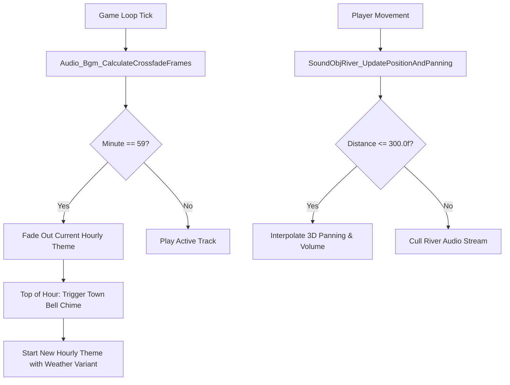

# Sound, Audio & Speech Synthesis Engine

> **Subsystem:** Audio & Music  
> **Status:** Fully Reverse-Engineered  
> **Binary Source:** `exefs.elf` (`0x001D9CC4` - `0x001DA184`, `0x0020AFE0` - `0x0020B28C`, `0x00246938` - `0x00246C6C`, `0x005831A8` - `0x00589F40`)  
> **C++ Types Header:** [`types/Audio.h`](../types/Audio.h)  
> **Target Data Files:** RomFS `Sound/` (`.bcstm`, `.bcsar`)

---

## 1. Architecture Overview

Animal Crossing: New Leaf features an intricate dynamic sound engine composed of three major subsystems:

1. **Stage BGM Manager (`audio::bgm::StageOpusMgr`):** Manages all background music streams, routing them across stages (town outdoor, buildings, tours, events, minigames).
2. **24 Hourly Town Themes & Weather Variations:** Evaluates time to play 24 distinct hourly compositions, crossfading at minute 59 and modulating acoustic instrumentation based on active precipitation (Clear, Rain, Snow).
3. **Positional Environmental Sound Emitters (`SoundObj`):** Emits dynamic 3D audio for rivers, waterfalls, sea surf, and gyroids.
4. **Animalese Speech Synthesizer (`SoundObjNpc`):** Generates NPC voices in real-time by concatenating phoneme sound effects (`0x01000565`) modulated by a 13-note chromatic semitone pitch scale.

---

## 2. Hourly BGM & Minute 59 Crossfade

### 2.1 24 Hourly Themes $\times$ 3 Weather Arrangements
Every hour of the day in town features a distinct musical composition with 3 separate audio arrangements:
- **Sunny / Clear:** Full acoustic instrumentation (guitars, upright bass, marimbas, accordions).
- **Rain:** Muted, intimate mix with solo piano, soft bells, and audible raindrop textures.
- **Snow:** High-frequency crystalline glockenspiel, celesta, and gentle sustained pads.

### 2.2 Minute 59 Crossfade Formula (`0x00588BEC`)
At minute 59 of each hour, `Audio_Bgm_CalculateCrossfadeFrames` computes the exact number of frames remaining before the top of the hour:

$$\Delta t_{\text{ms}} = 60000 - \left((S + 5) \times 1000 + \text{MS}\right)$$

$$T_{\text{fade}} = \max\left(0, \left\lfloor \frac{\Delta t_{\text{ms}} \times 30}{1000} \right\rfloor\right)$$

At the 00:00 mark, the church bell chime rings the exact hour count (e.g. 3 rings for 3:00 PM), followed by the seamless entrance of the next hourly track.

---

## 3. Environmental Positional Audio (`SoundObj`)

### 3.1 `SoundObjRiver` (River Emitter)
- **Culling Radius:** 300.0 units (`0x43960000`). Beyond this distance, the audio voice is completely deallocated.
- **Spline Nearest-Point Tracking:** In `SoundObjRiver_UpdatePositionAndPanning` (`0x002469C8`), the game calculates the orthogonal projection of the player's 3D coordinates onto the town's river spline. The virtual sound emitter smoothly slides along the riverbank closest to the player, providing natural continuous panning.

### 3.2 `SoundObjFall` (Waterfall Emitter)
- **Sound Effect ID:** `0x01000786` (`kSfxWaterfallRoar`).
- **Attenuation:** Exponential distance decay centered on the waterfall cliff drop and river mouth estuary.

---

## 4. Animalese Speech Synthesizer (`SoundObjNpc`)

When a villager speaks, their text is parsed into individual phonemes:
1. For each character, sound effect `0x01000565` is triggered.
2. The pitch is transposed using the chromatic scale:

$$\text{PitchSemitone} = S_i - 9$$

Where $S_i \in \{-5, -3, -1, 0, 2, 4, 5, 7, 9, 11, 12, 14, 16\}$.
- **Peppy (`Zk`):** Samples upper semitones (+7, +9, +12) for high-pitched, enthusiastic speech.
- **Cranky (`Ko`):** Samples lower semitones (-5, -3, -1) for deep, raspy voices.
- **Lazy (`Bo`) & Normal (`Fu`):** Samples central semitones (0, +2, +4) for mellow tones.

---

## 5. Function Catalog

| Address | Function Symbol | Description |
|---|---|---|
| `0x005831A8` | `Audio_Bgm_StageOpusMgr_Init` | Initializes StageOpusMgr singleton and binds audio dispatch channels |
| `0x005832F8` | `Audio_Bgm_SwitchStageBgm` | Crossfades and switches stage music stream based on target location |
| `0x0058392C` | `Audio_Bgm_ResolveStageId` | Maps location flags to specific StageOpus BGM classes |
| `0x00588BEC` | `Audio_Bgm_CalculateCrossfadeFrames` | Computes minute 59 countdown frames for smooth hourly theme transition |
| `0x00589F40` | `Audio_Bgm_SetTrackVolumeAndFade` | Sets target volume and frame fade rate on active BGM voice |
| `0x00246938` | `SoundObjRiver_Init` | Binds river positional sound emitter and allocates audio stream |
| `0x002469C8` | `SoundObjRiver_UpdatePositionAndPanning`| Culls river audio at 300 units and tracks nearest spline coordinate |
| `0x00246B94` | `SoundObjRiver_StopAndRelease` | Halts river audio stream and releases voice |
| `0x0020AFE0` | `SoundObjFall_Init` | Initializes waterfall emitter with SFX ID 0x01000786 |
| `0x0020B0FC` | `SoundObjFall_Update` | Updates 3D positional panning and distance volume decay for waterfall |
| `0x001D9CC4` | `SoundObjNpc_Init` | Binds NPC voice emitter to actor transform |
| `0x001D9E6C` | `SoundObjNpc_UpdateVoiceSynthesis` | Synthesizes Animalese speech modulating 0x01000565 across 13 pitch semitones |
