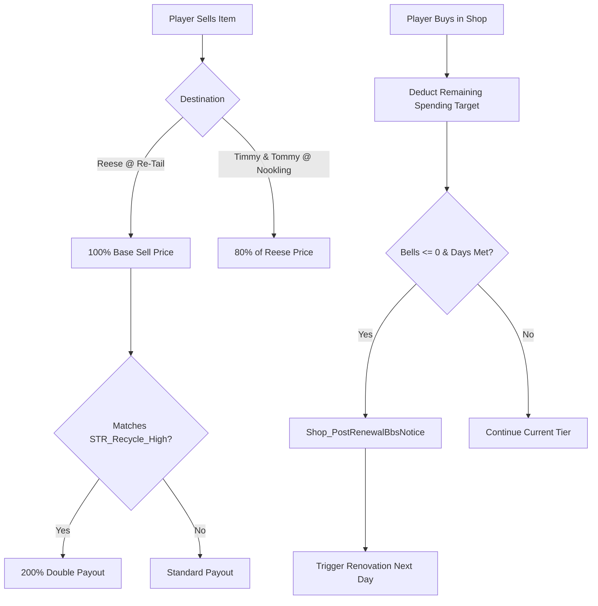

# Shop, Economy & Commerce Subsystem

> **Subsystem:** Shop & Economy  
> **Status:** Fully Reverse-Engineered  
> **Binary Source:** `exefs.elf` (`0x001E423C` - `0x001E57B8`, `0x0056C548` - `0x0056C807`, `0x0088E5E4` - `0x0088E624`)  
> **C++ Types Header:** [`types/Economy.h`](../types/Economy.h)  
> **Related Files:** [`systems/time-engine.md`](time-engine.md), [`systems/save-data.md`](save-data.md)

---

## 1. Architecture Overview

The economy in Animal Crossing: New Leaf revolves around three major financial engines:

1. **Nookling General Store (`dSvShopZakka`):** Timmy and Tommy's five-tier progression store, featuring spending tracking, minimum operating day timers, and daily stocking with sold-out card markers.
2. **Re-Tail Flea Market & Recycling (`AcStrcRecycleShop`):** Reese (`AcNpcSpShopRecycle`) and Cyrus, providing the primary selling point for town goods, setting the daily blackboard premium item (`STR_Recycle_High`), and hosting an 8-slot interactive flea market.
3. **Turnip Stock Market (Stalk Exchange):** Weekly turnip speculation with prices updating twice daily (9:00 AM and 12:00 PM), tracking 4 distinct price curve patterns generated each Sunday at 6:00 AM.

---

## 2. Nookling Store Upgrades

The Nookling store progresses through 5 tiers. Upgrades require fulfilling two simultaneous criteria:
1. Accumulating total Bells spent at the current tier.
2. Operating the current tier for a minimum number of in-game calendar days.

### 2.1 Upgrade Thresholds (`0x0088e5e4` & `0x0088e5f8`)

| From Tier | To Tier | Bells Spent (`DAT_0088e5e4`) | Min Days (`DAT_0088e5f8`) | Additional Conditions |
|---|---|---|---|---|
| **0. Junction** | **1. T&T Mart** | 12,000 Bells | 7 days | Moved out of tent into a house |
| **1. T&T Mart** | **2. Super T&T** | 25,000 Bells | 10 days | 10 days since Gardening Store opened |
| **2. Super T&T** | **3. T.I.Y.** | 50,000 Bells | 21 days | None |
| **3. T.I.Y.** | **4. T&T Emporium** | 100,000 Bells | 30 days | Pass 4 Gracie Fashion Checks |

### 2.2 Renovation Sequence & Bulletin Notice

When the conditions are satisfied in `Shop_AddSpendingAndCheckUpgrade` (`0x001E5218`):
1. `param_1[0x15]` is incremented to the pending tier.
2. Renovation flags are committed via `FUN_005cce8c(param_1)` and `FUN_005cce40(param_1, 1)`.
3. `Shop_PostRenewalBbsNotice` (`0x001E5628`) formats and posts an official announcement to the town bulletin board using strings from `BBS_Kodanuki.umsbt`.
4. On the subsequent day, the store is closed for remodeling with scaffolding placed over the exterior structure.

---

## 3. Re-Tail Economics & Flea Market

Re-Tail serves as the economic hub for selling inventory items:

### 3.1 Valuation Comparison

| Transaction | Rate | Formula |
|---|---|---|
| **Reese (Standard Sell)** | 100% | $P_{\text{sell}}$ |
| **Timmy & Tommy (Nookling)** | 80% | $0.80 \times P_{\text{sell}}$ |
| **Reese (Premium Item)** | 200% | $2.00 \times P_{\text{sell}}$ |
| **Catalog Re-Order Purchase** | 400% | $4.00 \times P_{\text{sell}}$ |

### 3.2 Premium Item of the Day (`STR_Recycle_High`)
At 6:00 AM daily reset, `RecycleShop_InitDailyPremiumItem` (`0x0056C548`) selects a randomized item category or item ID and writes it to the exterior chalkboard:
- If the town has the **Bell Boom Ordinance** enacted, two premium items are chosen simultaneously.
- Sells for exactly double the regular Re-Tail price.

### 3.3 Flea Market Tables
Re-Tail contains 8 flea market selling tables initialized by `RecycleShop_InitFleaMarketStalls` (`0x0056C634`):
- Players can place items and set custom asking prices (up to $4 \times P_{\text{sell}}$ without villagers balking).
- Villagers visiting the shop browse the stalls and decide whether to purchase based on personality and asking price.

---

## 4. Turnip Stock Market (Stalk Exchange)

### 4.1 Purchase from Joan (`AcNpcSpKaburiba`)
- Joan visits the town every Sunday between 6:00 AM and 12:00 PM.
- White turnips are sold in bunches of 10 at prices between **90 and 110 Bells** ($B_{\text{base}} \in [90, 110]$).
- Red turnips (if enabled) are sold as single seeds.
- Turnips rot at 6:00 AM the following Sunday, or immediately if the player travels backwards in time.

### 4.2 Weekly Price Waves (12 Half-Day Windows)
Prices are evaluated twice daily by Reese at Re-Tail:
- **Morning Price:** 9:00 AM – 11:59 AM
- **Afternoon Price:** 12:00 PM – 11:00 PM (closing time)
- Handled by `Shop_Turnip_CalculateNextPriceTime` (`0x001E42BC`) and `Shop_Turnip_CheckPriceExpiry` (`0x001E423C`).

### 4.3 Market Trends

| Pattern | Code | Description | Peak Multiplier |
|---|---|---|---|
| **Large Spike** | `0` | 3 declining periods, followed by a sharp 3-period surge | $200\% - 600\% \times B_{\text{base}}$ |
| **Small Spike** | `1` | 4 declining periods, followed by a mild 2-period surge | $140\% - 200\% \times B_{\text{base}}$ |
| **Decreasing** | `2` | Drops by 3–5 Bells every single half-day | Always losses ($< 50\%$) |
| **Fluctuating** | `3` | Unpredictable jumps throughout the week | $90\% - 140\% \times B_{\text{base}}$ |

---

## 5. Shop Floor Item Displays & Sold-Out Markers

When items are placed on the Nookling store shelves, they are assigned active display slots in `Shop_InitDailyStock` (`0x001E4718`):
- When a player buys an item, `Shop_BuyDisplayItem` (`0x001E4CF4`) decrements daily stock count and replaces the item entity with a red Sold Out marker card:
  - Furniture / Tools / Accessories: Replaced with `0x2083` (`kItemSoldOutNormal`).
  - Wallpaper / Flooring: Replaced with `0x2086` (`kItemSoldOutWallpaper`).

---

## 6. Function Catalog

| Address | Function Symbol | Description |
|---|---|---|
| `0x001E5218` | `Shop_AddSpendingAndCheckUpgrade` | Accumulates spending, checks days open, and triggers store tier upgrades |
| `0x001E5494` | `Shop_RecordPurchase` | Updates spending buffer and initiates save persistence |
| `0x001E4EC8` | `Shop_ApplyTierUpgrade` | Sets new tier ID, resets upgrade timers, and updates stock table sizes |
| `0x001E5628` | `Shop_PostRenewalBbsNotice` | Formats and posts store renovation notice to the town bulletin board |
| `0x001E42BC` | `Shop_Turnip_CalculateNextPriceTime` | Computes target timestamps for 9:00 AM / 12:00 PM turnip price shifts |
| `0x001E423C` | `Shop_Turnip_CheckPriceExpiry` | Checks active turnip window expiration and triggers price refresh |
| `0x001E4370` | `Shop_Catalog_CopyPlayerRecord` | Copies 640-byte (`0x280`) player catalog history and unlocked items |
| `0x001E4454` | `Shop_Catalog_CompactPlayerRecords` | Cleans up and compacts empty player catalog history records |
| `0x001E4718` | `Shop_InitDailyStock` | Initializes shop floor displays and restores sold-out card markers |
| `0x001E4CF4` | `Shop_BuyDisplayItem` | Processes item purchase and replaces entity with Sold Out marker (`0x2083`) |
| `0x0056C548` | `RecycleShop_InitDailyPremiumItem` | Randomizes and assigns daily premium double-price item for Re-Tail |
| `0x0056C634` | `RecycleShop_InitFleaMarketStalls` | Initializes the 8 flea market selling tables inside Re-Tail |
