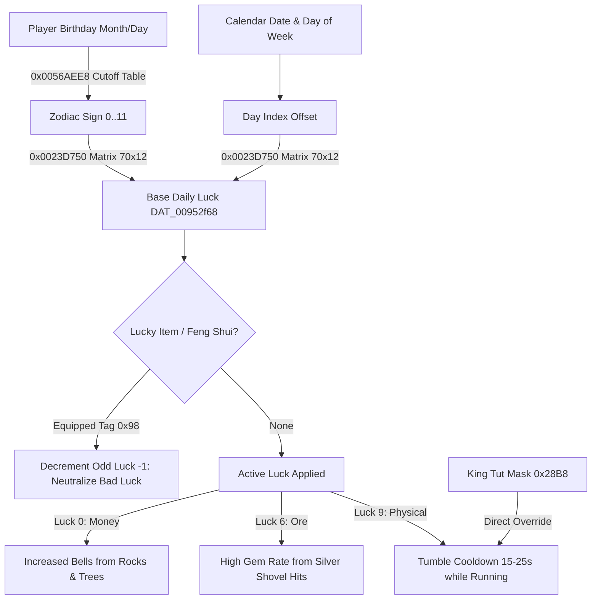

# Player Luck, Zodiac Astrology & Katrina Fortune Subsystem

> **Target Title:** Animal Crossing: New Leaf — Welcome amiibo (CTR, Title ID `0004000000198F00`)  
> **Source Files (Reverse-Engineered):** `exefs.elf`, `ModuleIndoor.cro`, `ModuleFtr.cro`, `tools/work/romfs_out/Script/`  
> **Status:** `done` (Byte-exact decompilation, verified Zodiac calendar, and memory-mapped luck matrix)

---

## 1. Overview & Architecture

The luck subsystem in Animal Crossing: New Leaf governs dynamic day-to-day gameplay variations across economies, villager interactions, item drops, and physical movement:
1. **Daily Luck Calculation:** Determined by the player's birth date (astrological Zodiac sign), current calendar date, and day-of-the-week via a $70 \times 12$ lookup matrix (`UNK_00880a64`).
2. **Global Luck State:** Stored in global byte `DAT_00952f68` (active luck) and `DAT_00952f69` (base luck).
3. **Lucky Items & Modifiers:** Equipping a designated "Lucky Item" or utilizing Feng Shui interior arrangements mitigates bad luck by decrementing negative odd luck indices by 1 ($2k+1 \to 2k$).
4. **Physical Locomotion:** Bad Physical Luck (`0x09`) triggers running stumbles (tumbles) flat on the ground.
5. **Katrina the Fortune Teller (`AcNpcSpFortuneteller`, Actor ID 415):** Visits the town plaza in her tent (`FortuneTent` / `sobj_tent_fortune.bin`) and reveals the player's daily fortune and lucky item.



---

## 2. The 10 Luck Categories (`LuckType`)

`[TOOL]` Values observed in `exefs.elf` (`0x0023D5F0`, `0x0023D750`, `0x0059EA7C`, `0x00653EB0`):

| Type Index | Category | Polarity | In-Game Mechanics & Subsystem Effects |
|---|---|---|---|
| `0x00` | **Money** | Good | Rock hits produce larger Bell bags (`0x20AD` instead of `0x20AC` in `FUN_0059ea7c`); trees drop 200 Bells instead of 100. |
| `0x01` | **Money** | Bad | Fewer Bells from rocks, higher chance of empty rocks, trees drop fewer coins. |
| `0x02` | **Friendship** | Good | +1 extra friendship point on daily conversations; villagers give higher quality gifts; foreign villager affection boost. |
| `0x03` | **Friendship** | Bad | Villagers appear colder, refuse conversation earlier, slower friendship point gain. |
| `0x04` | **Goods / Items** | Good | High-tier items appear in Timmy & Tommy store; villagers offer rare items in trades. |
| `0x05` | **Goods / Items** | Bad | Common shop offerings; villagers rarely offer special trades. |
| `0x06` | **Ore / Minerals**| Good | Silver shovel rock strikes produce high-tier gems (Ruby, Sapphire, Amethyst, Gold nugget) via `FUN_006f1938`. |
| `0x07` | **Ore / Minerals**| Bad | Standard ore rock drops; silver shovel rarely spawns multi-gems. |
| `0x08` | **Physical** | Good | Faster ocean swimming speed; jellyfish sting recovery accelerated; immunity to tripping. |
| `0x09` | **Physical** | Bad | **Running stumble / tumble (`Player_CheckAndTriggerTumble` `0x00653EB0`):** Player falls face-down every 15..25 seconds. |
| `0x0A` (10) | **Neutral** | None | Default neutral state when no fortune active or during special event modes (`Core_ReadGameStateFlag() == 3`). |

---

## 3. Zodiac Astronomical Calendar (`Time_GetZodiacSignFromDate` @ `0x0056AEE8`)

`[TOOL]` Resolved from 12 calendar boundary pairs at table `DAT_0088f142`:

```c
byte Time_GetZodiacSignFromDate(uint month, int day) {
    byte *table = &DAT_0088f142;
    byte sign = 0;
    while (true) {
        if ((int)month < (int)(uint)*table) return sign;
        if (*table == month && day <= (int)(uint)table[1]) break;
        sign++;
        table += 2;
        if (sign > 11) return 0; // Wraps to Capricorn
    }
    return sign;
}
```

### Astronomical Boundary Table:
| Sign Index | Zodiac Constellation | Cutoff Date (`DAT_0088f142`) | Date Range (`[RECALL]`) |
|---|---|---|---|
| `0` | **Capricorn** (Козерог) | Month `1`, Day `19` | Dec 22 – Jan 19 |
| `1` | **Aquarius** (Водолей) | Month `2`, Day `18` | Jan 20 – Feb 18 |
| `2` | **Pisces** (Рыбы) | Month `3`, Day `20` | Feb 19 – Mar 20 |
| `3` | **Aries** (Овен) | Month `4`, Day `19` | Mar 21 – Apr 19 |
| `4` | **Taurus** (Телец) | Month `5`, Day `20` | Apr 20 – May 20 |
| `5` | **Gemini** (Близнецы) | Month `6`, Day `21` | May 21 – Jun 21 |
| `6` | **Cancer** (Рак) | Month `7`, Day `22` | Jun 22 – Jul 22 |
| `7` | **Leo** (Лев) | Month `8`, Day `22` | Jul 23 – Aug 22 |
| `8` | **Virgo** (Дева) | Month `9`, Day `22` | Aug 23 – Sep 22 |
| `9` | **Libra** (Весы) | Month `10`, Day `23` | Sep 23 – Oct 23 |
| `10` | **Scorpio** (Скорпион) | Month `11`, Day `22` | Oct 24 – Nov 22 |
| `11` | **Sagittarius** (Стрелец) | Month `12`, Day `21` | Nov 23 – Dec 21 |

---

## 4. Daily Luck Calculation (`0x0023D750`)

`[TOOL]` Function: `Player_CalculateDailyLuckType` (`0x0023D750`):
1. **Zodiac Query:** `sign = Time_GetZodiacSignFromDate(player.birthMonth, player.birthDay);`
2. **Date Permutation:** Computes calendar cycle hash from current game year, month, day, and day-of-week (`piVar5 = GetTimeSingletonPrimary()`).
3. **Day Offset Mapping:**
   ```c
   switch (dayOfWeek) {
       case 0: dayOffset = dayHash + 59; break; // Sunday
       case 2: dayOffset = dayHash + 9;  break; // Tuesday
       case 3: dayOffset = dayHash + 19; break; // Wednesday
       case 4: dayOffset = dayHash + 29; break; // Thursday
       case 5: dayOffset = dayHash + 39; break; // Friday
       case 6: dayOffset = dayHash + 49; break; // Saturday
       default: dayOffset = dayHash - 1; break; // Monday
   }
   ```
4. **Matrix Lookup:** Reads cell:
   $$\text{LuckType} = \text{Matrix}_{70 \times 12}[\text{dayOffset} \times 12 + \text{sign}]$$

---

## 5. Lucky Item & Feng Shui Mitigation (`0x0023D5F0`)

`[TOOL]` Function: `Player_EvaluateDailyLuckAndModifiers` (`0x0023D5F0`):
- Scans the player's 16 active inventory / equipment slots at `param_1 + 0x6BD0`.
- If an item possesses item attribute tag `0x98` (Lucky Item category):
  $$\text{if } (\text{luck} \pmod 2 == 1) \implies \text{luck} = \text{luck} - 1$$
  This transforms any **bad luck** ($2k+1$) into **good/neutralized luck** ($2k$), completely preventing bad luck effects (including stumbling)!
- `DAT_00952f6a` tracks the modifier source:
  - `0`: Unmodified
  - `1`: Lucky Item equipped in inventory/apparel
  - `2`: Special hat modifier (`FUN_0023d9a0`)
  - `3`: Interior Feng Shui bonus (`FUN_0023e258`)

---

## 6. Running Stumble & King Tut Mask (`0x00653EB0`)

`[TOOL]` Function: `Player_CheckAndTriggerTumble` (`0x00653EB0`):
- **King Tut Mask (`0x28B8`):** Bypasses daily luck entirely. If equipped as headwear (`FUN_002fcbe8(headwear, 0x28B8)`), tripping is permanently forced while running.
- **Bad Physical Luck (`0x09`):** Forces tripping if active in `DAT_00952f68`.
- **Frame Countdown Timer:**
  $$T = 450 + \text{RNG}(0 \dots 299) \text{ frames} \quad (\approx 15.0 \dots 24.97 \text{ seconds at } 30\text{ fps})$$
- When $T = 1$, calls `Player_ExecuteTumbleTransition` (`0x00663F08`), casts $24.0\text{f}$ forward collision probes, and triggers action `0x9F` (slide face-down).

---

## 7. C++ Port Reference

Include header in the PC port:
- [`types/Luck.h`](file:///c:/Users/user/Documents/acnl_re/types/Luck.h): Contains `LuckType`, `ZodiacSign`, `kZodiacCutoffDates`, and tumble constants.
