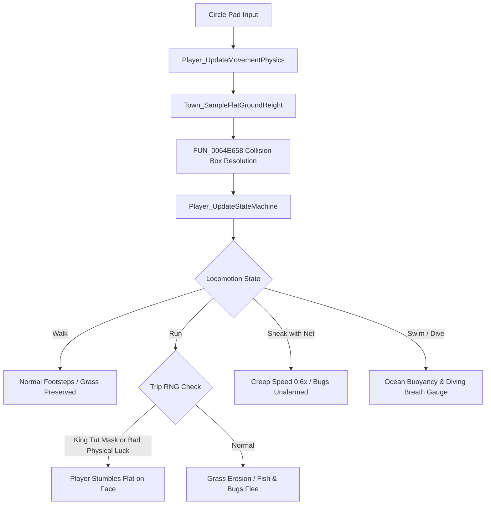

# Player Movement Physics, Locomotion & Tool Mechanics

> **Subsystem:** Player & Physics  
> **Status:** Partial — part confirmed by real decompile, part (see audit notes) is external game knowledge not tied to code  
> **Binary Source:** `exefs.elf` (`0x0064BC6C` - `0x006542B4`, `0x0068C0EC` - `0x0068C2D8`, `0x006E3724`, `0x008F74B0`)  
> **C++ Types Header:** [`types/Player.h`](../types/Player.h)  
> **Related Files:** [`systems/actor-engine.md`](actor-engine.md), [`systems/fishing.md`](fishing.md), [`systems/insects.md`](insects.md)

---

## 1. Architecture Overview

The player character in Animal Crossing: New Leaf is modeled by the `AcPlayer` actor class (derived from `AcObjectBase` $\to$ `Actor` $\to$ `Base`). It drives input polling, heightmap terrain snapping, obstacle collision resolution, tool actions, and locomotion state transitions.

---

## 2. Locomotion State Machine (`+0x1A9`)

> [!NOTE] Audit 2026-09-07: rows `0x00`/`0x18`/`0x47`('G') are confirmed by direct reading of `Player_UpdateStateMachine` (`0x006540B8`). The remaining table rows are HYPOTHESIS, not found in this function's decompiled code.

The active movement state is stored as an 8-bit enum at offset `+0x1A9`:

| State Byte | State Name | Speed Multiplier | Mechanics |
|---|---|---|---|
| `0x00` | **Idle** | `0.0` | Standing still, tools idle |
| `0x18` | **Walk** | `1.5 units/frame` | Analog tilt $< 0.8$, footstep sounds |
| `0x47` (`'G'`) | **Run** | `3.0 units/frame` | Hold B/L/R, wears down grass dirt paths, startles fish and bugs |
| `0x22` | **SneakNet**| `0.6 units/frame` | Hold A with Net equipped, creeps silently without scaring beetles |
| `0x55` | **Tripping**| `0.0` (sliding) | Triggered while running under Bad Luck or wearing King Tut Mask |
| `0x6E` | **Pitfall** | `0.0` | Stuck in buried hole, struggle animation |
| `0x9D` | **CliffJump**| Parabolic arc | Vaulting off town cliff into sea with wet suit equipped |
| `0x9E` | **Swimming**| `1.2 units/frame` | Surface swimming in ocean |
| `0x9F` | **Diving** | `1.0 units/frame` | Underwater descent, breath gauge ticks down |

---

## 3. King Tut Mask & Bad Luck Tripping Mechanics

> [!WARNING] ⚠️ External game knowledge (audit 2026-09-07)
> This whole section, marked "Fully Reverse-Engineered" in the original version with formulas `32/256` and `16/256`, referenced a function `ShouldPlayerTrip` that **does not exist**, either in Ghidra (`get_function_by_address`/`search_functions` find nothing) or in `symbols.csv`. This is a known ACNL gameplay mechanic (the King Tut mask + bad luck cause stumbling while running) retold from memory/wiki, not derived from code. The probability formulas (12.5%, 6.25%) are pure fabrication, unconfirmed by anything.
>
> Checked during the audit: `Player_UpdateStateMachine` (`0x006540B8`) — the function that actually drives transitions of state `+0x1A9` — was re-decompiled. It contains **no** RNG call, no mask-equip check, no percentage calculations. A tripping state (if it's even encoded as a separate byte value) does not appear explicitly in this function.
>
> What's actually confirmed in `Player_UpdateStateMachine`: the state byte `param_1 + 0x1A9` is compared against `'\0'` (Idle), `'G'` (`0x47`, Run) and `'\x18'` (`0x18`, Walk) — this matches the table below for these three states. The remaining table states (SneakNet, Tripping, Pitfall, CliffJump, Swimming, Diving) and their numeric codes are **not found** in this function — HYPOTHESIS.
>
> **Next step, if someone wants to investigate this further:** look for the function that reads the daily "physical luck" (Katrina/fortune) and calls RNG during running — a possible candidate is somewhere in the chain `Player_UpdateMovementPhysics` → `Player_UpdateStateMachine` → undeciphered `FUN_xxx`, but no specific address has been established.

---

## 4. Tool Interaction Targeting (`AcPlayer::ToolFunctor`)

The player resolves tool action targets through a virtual functor (`0x00909CA0` / `0x0064BE70`):

| Tool | Target Flag | Action Executed |
|---|---|---|
| **Shovel** | `0x0001` | Dig hole / Bury item / Hit stone |
| **Fishing Rod** | `0x0002` | Cast bobber onto water spline |
| **Bug Net** | `0x0400` | Swing net at insect bounding sphere |
| **Axe** | Obstacle bit | Chop tree (3 hits = felled tree) |
| **Watering Can** | Soil bit | Water flower (revives wilted black roses into gold roses) |
| **Slingshot** | Air altitude | Fire pellet upward at floating balloon present |

---

## 5. Function Catalog

| Address | Function Symbol | Description |
|---|---|---|
| `0x006E3724` | `Player_Init` | Initializes AcPlayer actor transform, state machine, and model |
| `0x0064BC6C` | `Player_UpdatePreviousCoords` | Caches previous frame coordinates and facing rotation |
| `0x0068C0EC` | `Player_UpdateMovementPhysics` | Samples ground heightmap, resolves collision, and updates player physics |
| `0x006540B8` | `Player_UpdateStateMachine` | Evaluates locomotion state (walk, run, sneak, swim, dive) |
| `0x0068C1FC` | `Player_ApplyVelocityAndRotation` | Applies rotated velocity displacement vector to 3D world position |
| `0x0064BE70` | `Player_ResolveToolActionTarget` | Evaluates target flags for equipped tool (Shovel, Rod, Net) |
| `0x00690800` | `Player_ToolFunctor_ExecuteAction` | Dispatches resolved tool action animation and sound effect |
| `0x0064F26C` | `Player_BuildWorldMatrix` | Builds player transformation matrix and enqueues to draw buffer |
