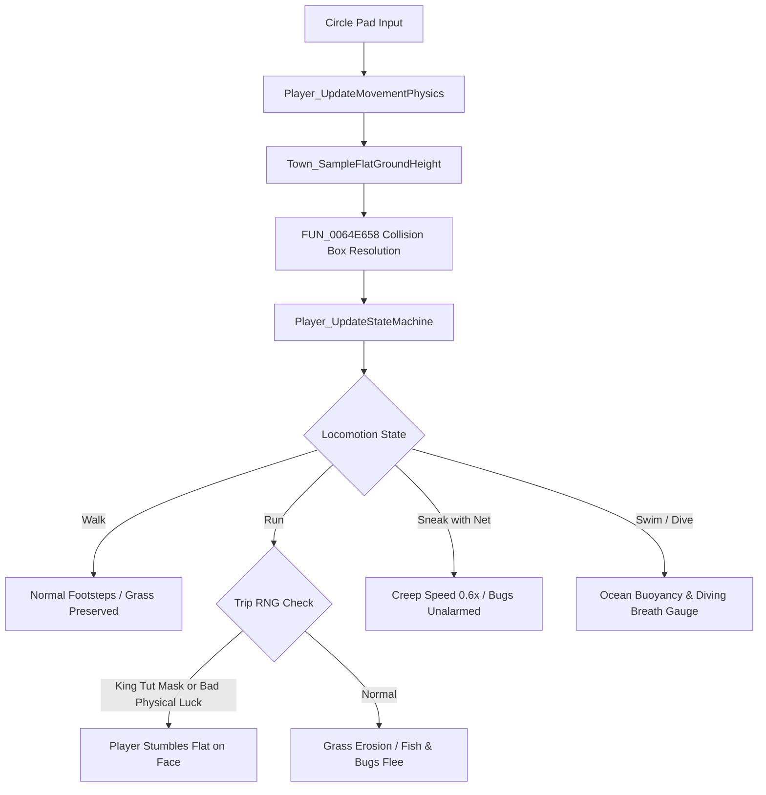

# Player Movement Physics, Locomotion & Tool Mechanics

> **Subsystem:** Player & Physics  
> **Status:** Partial — part confirmed by real decompile, part (see audit notes) is external game knowledge not tied to code  
> **Binary Source:** `exefs.elf` (`0x0064BC6C` - `0x006542B4`, `0x0068C0EC` - `0x0068C2D8`, `0x006E3724`, `0x008F74B0`)  
> **C++ Types Header:** [`types/Player.h`](../types/Player.h)  
> **Related Files:** [`systems/actor-engine.md`](actor-engine.md), [`systems/fishing.md`](fishing.md), [`systems/insects.md`](insects.md)

---

## 1. Architecture Overview

The player character in Animal Crossing: New Leaf is modeled by the `AcPlayer` actor class (derived from `AcObjectBase` $\to$ `Actor` $\to$ `Base`). It drives input polling, heightmap terrain snapping, obstacle collision resolution, tool actions, and locomotion state transitions.

```mermaid
graph TD
    A[Circle Pad Input] --> B[Player_UpdateMovementPhysics]
    B --> C[Town_SampleFlatGroundHeight]
    C --> D[FUN_0064E658 Collision Box Resolution]
    D --> E[Player_UpdateStateMachine]
    E --> F{Locomotion State}
    F -->|Walk| G[Normal Footsteps / Grass Preserved]
    F -->|Run| H{Trip RNG Check}
    H -->|King Tut Mask or Bad Physical Luck| I[Player Stumbles Flat on Face]
    H -->|Normal| J[Grass Erosion / Fish & Bugs Flee]
    F -->|Sneak with Net| K[Creep Speed 0.6x / Bugs Unalarmed]
    F -->|Swim / Dive| L[Ocean Buoyancy & Diving Breath Gauge]
```

---

## 2. Locomotion State Machine (`+0x1A9`)

> [!NOTE] Audit 2026-09-07: rows `0x00`/`0x18`/`0x47`('G') are confirmed by direct reading of `Player_UpdateStateMachine` (`0x006540B8`). The remaining table rows are HYPOTHESIS, not found in this function's decompiled code.

The active movement state is stored as an 8-bit enum at offset `+0x1A9`:

| State Byte | State Name | Speed Multiplier | Mechanics |
|---|---|---|---|
| `0x00` | **Idle** | `0.0` | Standing still, tools idle |
| `0x18` | **Walk** | `1.5 units/frame` | Analog tilt $< 0.8$, footstep sounds |
| `0x47` (`'G'`) | **Run** | `3.0 units/frame` | Hold B/L/R, wears down grass dirt paths, startles fish and bugs |
| `0x22` | **SneakNet**| `0.6 units/frame` | Hold A with Net equipped, creeps silently without scaring beetles |
| `0x55` | **Tripping**| `0.0` (sliding) | Triggered while running under Bad Luck or wearing King Tut Mask |
| `0x6E` | **Pitfall** | `0.0` | Stuck in buried hole, struggle animation |
| `0x9D` | **CliffJump**| Parabolic arc | Vaulting off town cliff into sea with wet suit equipped |
| `0x9E` | **Swimming**| `1.2 units/frame` | Surface swimming in ocean |
| `0x9F` | **Diving** | `1.0 units/frame` | Underwater descent, breath gauge ticks down |

---

## 3. King Tut Mask & Bad Luck Tripping Mechanics (TUMB)

`[TOOL]` Reverse-engineered from `Player_CheckAndTriggerTumble` (`0x00653EB0`) and `Player_ExecuteTumbleTransition` (`0x00663F08`).
Internal debug identifier: `"TUMB To<%.2f> C<%d>"`.

### 3.1 Trigger Conditions
Tripping while running (`FUN_006e3c74(*(int16_t*)(param_1 + 0x224)) != 0`) is activated under either of two conditions:
1. **Equipped King Tut Mask (`0x28B8`):** Verified by `FUN_002fcbe8(headwear, 0x28B8)`. Forces tripping regardless of daily luck.
2. **Bad Physical Luck (`DAT_00952f68 == 0x09`):** Calculated by `Player_CalculateDailyLuckType` (`0x0023D750`). Wearing a Lucky Item equipped in inventory/headwear decrements this to `0x08`, neutralizing the stumbling effect (`Player_EvaluateDailyLuckAndModifiers` `0x0023D5F0`).

### 3.2 Countdown Frame Timer Math
Instead of a fixed per-step probability percentage, the game uses a continuous running frame timer at `param_1 + 0x1550`:
- **Cooldown Interval:** When the timer reaches `0`, it is reset to:
  $$T = 450 + \text{RNG}(0 \dots 299) \text{ frames}$$
- **Time Window:** At 30.0 fps, this guarantees between **15.0 and 24.97 seconds** of continuous running before each stumble attempt.
- **Trigger Execution:** When the timer decrements to `1`, `Player_ExecuteTumbleTransition` (`0x00663F08`) validates the path ahead with collision raycasts at $24.0\text{f}$ distance (`0x41C00000`). If unobstructed, action `0x9F` (sliding tumble face-down) is triggered via `FUN_0064c100(param_1, 0x9f, 0)`. If obstructed, the timer is held at `1` until a clear surface is reached.

---

## 4. Tool Interaction Targeting (`AcPlayer::ToolFunctor`)

The player resolves tool action targets through a virtual functor (`0x00909CA0` / `0x0064BE70`):

| Tool | Target Flag | Action Executed |
|---|---|---|
| **Shovel** | `0x0001` | Dig hole / Bury item / Hit stone |
| **Fishing Rod** | `0x0002` | Cast bobber onto water spline |
| **Bug Net** | `0x0400` | Swing net at insect bounding sphere |
| **Axe** | Obstacle bit | Chop tree (3 hits = felled tree) |
| **Watering Can** | Soil bit | Water flower (revives wilted black roses into gold roses) |
| **Slingshot** | Air altitude | Fire pellet upward at floating balloon present |

---

## 5. Function Catalog

| Address | Function Symbol | Description |
|---|---|---|
| `0x006E3724` | `Player_Init` | Initializes AcPlayer actor transform, state machine, and model |
| `0x0064BC6C` | `Player_UpdatePreviousCoords` | Caches previous frame coordinates and facing rotation |
| `0x0068C0EC` | `Player_UpdateMovementPhysics` | Samples ground heightmap, resolves collision, and updates player physics |
| `0x006540B8` | `Player_UpdateStateMachine` | Evaluates locomotion state (walk, run, sneak, swim, dive) |
| `0x0068C1FC` | `Player_ApplyVelocityAndRotation` | Applies rotated velocity displacement vector to 3D world position |
| `0x0064BE70` | `Player_ResolveToolActionTarget` | Evaluates target flags for equipped tool (Shovel, Rod, Net) |
| `0x00690800` | `Player_ToolFunctor_ExecuteAction` | Dispatches resolved tool action animation and sound effect |
| `0x0064F26C` | `Player_BuildWorldMatrix` | Builds player transformation matrix and enqueues to draw buffer |
| `0x00653EB0` | `Player_CheckAndTriggerTumble` | Evaluates King Tut mask / bad luck and runs tumble cooldown countdown |
| `0x00663F08` | `Player_ExecuteTumbleTransition` | Validates forward terrain collision and triggers 0x9F tumble slide action |
