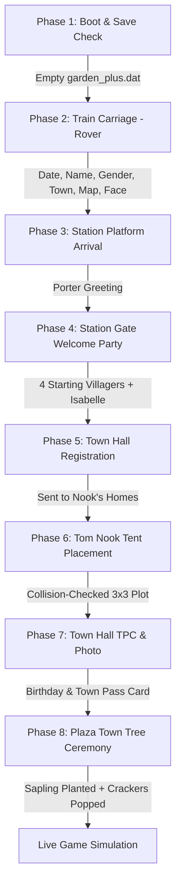
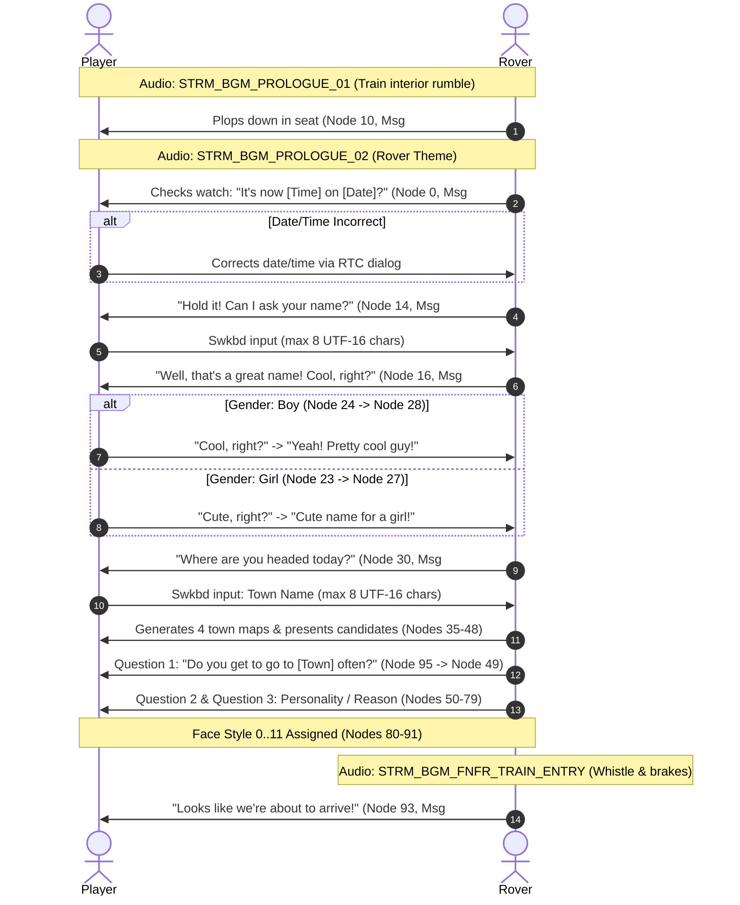
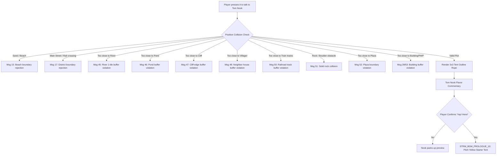
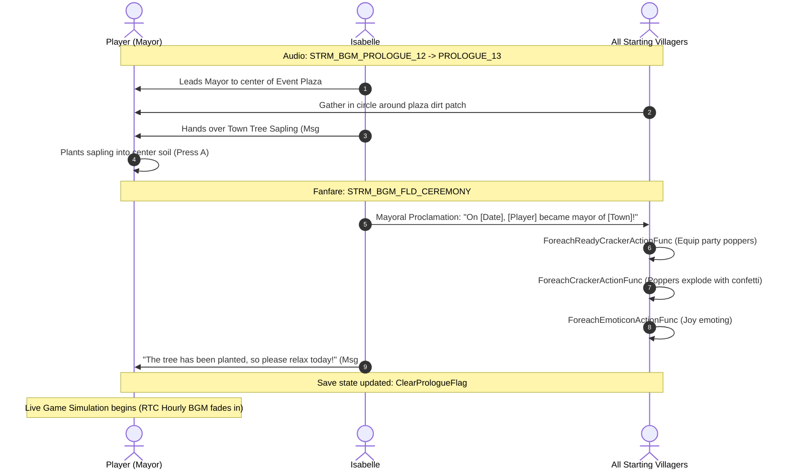

# Prologue & Introduction Subsystem Specification

> **Subsystem:** Prologue, Player Setup & Town Initialization  
> **Status:** Fully Reverse-Engineered (`[TOOL]`-verified against RomFS binary scripts, CRO dynamic libraries, and `exefs.elf`)  
> **Binary Sources:**  
> - `exefs.elf` (`0x0027C2CC` `Town_GenerateTownOptions_Main`, `0x0027C8FC` `Town_GenerateTownLayout_4Options`, `0x00200D34` `Town_FieldFactory_CreateBuilderForState`)  
> - CTR Relocatable Objects: `ModuleTrain.cro` (106,496 bytes), `ModulePrologue.cro` (61,440 bytes), `ModuleCeremony.cro` (36,864 bytes)  
> - Script Flowcharts: `Script/Flow/NPC_Rover_Train.msbf`, `NPC_Station_Prologue.msbf`, `NNPC_Sp_Prologue.msbf`, `NPC_Prologue_1..6.msbf`, `NPC_Secretary_Ceremony.msbf`  
> - Text Containers: `Script/Talk/NPC_Rover_Train.umsbt`, `NPC_Prologue_1..5.umsbt`, `{AN,BO,FU,GE,HA,KO,OT,ZK}_Sp_Prologue.umsbt`  
> - Audio Streams: RomFS `Sound/stream/STRM_BGM_PROLOGUE_01..13.bcstm`, `STRM_BGM_FNFR_TRAIN_ENTRY.bcstm`, `STRM_BGM_FLD_CEREMONY.bcstm`

---

## 1. Overview & State Progression

When launching a new save file in *Animal Crossing: New Leaf — Welcome amiibo*, the engine executes a strict 8-phase prologue sequence that initializes the player character, generates the town topography, places the provisional residence, and registers the player as the town's Mayor:



---

## 2. Phase 1: Boot & Save Validation

1. **Title Sequence:** The game plays `STRM_BGM_TITLE` while rendering a roaming camera over predefined scenic town acres.
2. **Save Existence Check `[TOOL]`:**
   - Function `Save_DeserializeSaveBuffer_ValidateChecksums` (`0x00756C54`) reads `garden_plus.dat`.
   - If no valid town header exists (checksum mismatch or empty header `0x53424`), the engine routes directly to `STATE_PROLOGUE_TRAIN` (`0x25`).
   - The engine loads `ModuleTrain.cro` into RAM and instantiates `VillagePrologueBuilder` via `Town_FieldFactory_CreateBuilderForState` (`0x00200D34`).
   - Train carriage interior model `Bg/Indoor/Models/idr_train.bcres` is streamed into VRAM.

---

## 3. Phase 2: Train Carriage & Rover Interaction (`NPC_Rover_Train`)

The train scene is managed by `AcNpcSpTrain` and `TrainCamera` (`ModuleTrain.cro`) running flowchart `NPC_Rover_Train.msbf` (126 nodes, 60 branches) linked to dialog strings in `NPC_Rover_Train.umsbt`:

### 3.1 Sequence Timeline & Dialog Nodes



### 3.2 Gender Selection Protocol `[TOOL]`
In `NPC_Rover_Train.msbf`, gender is determined by the player's reaction to Rover complimenting their name:
- **Node 16 (Msg #09):** Rover asks if the name is *"Cool, right?"* (Choice 0) or *"Cute, right?"* (Choice 1).
- **If "Cool, right?":**
  - Rover says: *"Yeah! You seem like a pretty cool guy to me!"* (Node 20, Msg #10).
  - Choice 0: *"I know, right!"* $\to$ **Gender = Boy (`0x00`)** (Node 28 `EVENT type=1 ev=120 param=0`).
  - Choice 1: *"I'm not a boy!"* $\to$ Rover apologizes (Node 26, Msg #12) $\to$ **Gender = Girl (`0x01`)** (Node 27 `EVENT type=1 ev=120 param=1`).
- **If "Cute, right?":**
  - Rover says: *"You're right! It is a cute name! And so fitting for a girl like you!"* (Node 21, Msg #11).
  - Choice 0: *"I know, right!"* $\to$ **Gender = Girl (`0x01`)** (Node 27 `EVENT type=1 ev=120 param=1`).
  - Choice 1: *"I'm not a girl!"* $\to$ Rover apologizes (Node 25, Msg #13) $\to$ **Gender = Boy (`0x00`)** (Node 28 `EVENT type=1 ev=120 param=0`).

### 3.3 4 Town Map Generation & Selection Loop `[TOOL]`
1. Flowchart executes **Node 123** (`EVENT type=1 ev=6 param=0`), calling `Town_GenerateTownOptions_Main` (`0x0027C2CC`).
2. The engine loads template files from RomFS:
   - `TemplateData/village/sea_side_left.bin` (2,240 bytes)
   - `TemplateData/village/sea_side_right.bin` (2,240 bytes)
3. It executes `Town_GenerateTownLayout_4Options` (`0x0027C8FC`), seeding Xorshift128 with the hardware clock:
   - Generates 4 independent, validated candidate layouts into layout buffers `DAT_00ad4cc8..DAT_00ad4cdc`.
4. Bottom-screen UI state machine `BsMenuMapSelect` (`ModuleTrain.cro`) opens:
   - **Candidate 0** displayed at Node 36 (`EVENT type=6 ev=3 param=0`).
   - Choice Prompt at Node 37: *"Is this it?"* $\to$ Yes leads to Node 48; No advances to Node 38.
   - **Candidate 1** displayed at Node 39 (`EVENT type=6 ev=4 param=0`).
   - Choice Prompt at Node 40: *"Is this it?"* $\to$ Yes leads to Node 48; No advances to Node 42.
   - **Candidate 2** displayed at Node 41 (`EVENT type=6 ev=5 param=0`).
   - Choice Prompt at Node 44: *"Is this it?"* $\to$ Yes leads to Node 48; No advances to Node 43.
   - **Candidate 3** displayed at Node 45 (`EVENT type=6 ev=6 param=0`).
   - Choice Prompt at Node 46: *"Is this it?"* $\to$ Yes leads to Node 48; No leads to Node 47 (*"Whhhaat?! But those are seriously the only stations on this line!"*) and loops back to Candidate 0 (Node 36).
5. When any map is confirmed: Node 48 branches to Node 100/101 (*"I see! That's where [Town] is!"*), and the chosen layout buffer is committed to the main town grid.

### 3.4 Face Appearance 12-Branch Decision Tree `[TOOL]`
Following map confirmation, Rover asks 3 successive questions. In `NPC_Rover_Train.msbf`, these evaluate through a $3 \times 2 \times 2$ tree directly targeting event nodes **80 through 91**, assigning Face Style IDs `0x00` through `0x0B`:

```
Question 1: "Do you get to go to [Town] very often?" (Node 95 -> Node 49)
├── Choice A: "I've never been there." (Node 50)
│   └── Question 2: "Why're you headed there?" (Node 53)
│       ├── Choice A1: "I'm moving." (Node 56)
│       │   └── Question 3: "Does that mean you haven't even seen your house yet?" (Node 62)
│       │       ├── "I'll get a place there."  ──> Node 68 ──> Node 80 ──> Face Style 0 (0x00)
│       │       └── "I'm sure I'll be fine."    ──> Node 69 ──> Node 81 ──> Face Style 1 (0x01)
│       └── Choice A2: "Can't say!" (Node 57)
│           └── Question 3: "Are you perhaps moving to a new town?" (Node 63)
│               ├── "You guessed it!"          ──> Node 70 ──> Node 82 ──> Face Style 2 (0x02)
│               └── "How'd you know?"          ──> Node 71 ──> Node 83 ──> Face Style 3 (0x03)
├── Choice B: "I don't remember." (Node 51)
│   └── Question 2: "What are you going there for?" (Node 54)
│       ├── Choice B1: "I'm moving." (Node 58)
│       │   └── Question 3: "You don't remember, but decided to move anyway?" (Node 64)
│       │       ├── "Yeah, pretty much."       ──> Node 72 ──> Node 84 ──> Face Style 4 (0x04)
│       │       └── "It's a mystery to me..."  ──> Node 73 ──> Node 85 ──> Face Style 5 (0x05)
│       └── Choice B2: "I don't know." (Node 59)
│           └── Question 3: "You seem like the type to do what you feel like!" (Node 65)
│               ├── "I guess so."              ──> Node 74 ──> Node 86 ──> Face Style 6 (0x06)
│               └── "It's fate!"               ──> Node 75 ──> Node 87 ──> Face Style 7 (0x07)
└── Choice C: "It's a secret!" (Node 52)
    └── Question 2: "How about telling me what you're headed there for?" (Node 55)
        ├── Choice C1: "I'm moving." (Node 60)
        │   └── Question 3: "Are you moving?!" (Node 66)
        │       ├── "Bingo!"                   ──> Node 76 ──> Node 88 ──> Face Style 8 (0x08)
        │       └── "Keep guessing!"           ──> Node 77 ──> Node 89 ──> Face Style 9 (0x09)
        └── Choice C2: "Messing around!" (Node 61)
            └── Question 3: "You're moving, eh? Just messing with me?" (Node 67)
                ├── "I really am moving."      ──> Node 78 ──> Node 90 ──> Face Style 10 (0x0A)
                └── "Just messing with you!"   ──> Node 79 ──> Node 91 ──> Face Style 11 (0x0B)
```

**Byte-Exact Event Parameter Table:**
| Target Node | Event Instruction Raw Bytes | Parameter (Hex) | Resulting Face ID | Face Characteristic |
|---|---|---|---|---|
| **Node 80** | `03 01 00 00 01 00 00 00 5c 00 07 00 00 00 00 00` | `0x0000` | **Face 0** | Classic dot eyes, subtle curved lashes |
| **Node 81** | `03 01 00 00 01 00 01 00 5c 00 07 00 00 00 00 00` | `0x0001` | **Face 1** | Wide sparkle eyes |
| **Node 82** | `03 01 00 00 01 00 02 00 5c 00 07 00 00 00 00 00` | `0x0002` | **Face 2** | Half-closed sleepy eyes |
| **Node 83** | `03 01 00 00 01 00 03 00 5c 00 07 00 00 00 00 00` | `0x0003` | **Face 3** | Triangle pupil anime eyes |
| **Node 84** | `03 01 00 00 01 00 04 00 5c 00 07 00 00 00 00 00` | `0x0004` | **Face 4** | Cheerful arched happy eyes |
| **Node 85** | `03 01 00 00 01 00 05 00 5c 00 07 00 00 00 00 00` | `0x0005` | **Face 5** | Small round beady eyes with blush |
| **Node 86** | `03 01 00 00 01 00 06 00 5c 00 07 00 00 00 00 00` | `0x0006` | **Face 6** | Horizontal line droopy eyes |
| **Node 87** | `03 01 00 00 01 00 07 00 5c 00 07 00 00 00 00 00` | `0x0007` | **Face 7** | Thick outline dark oval eyes |
| **Node 88** | `03 01 00 00 01 00 08 00 5c 00 07 00 00 00 00 00` | `0x0008` | **Face 8** | Rosy cheek wide circular pupils |
| **Node 89** | `03 01 00 00 01 00 09 00 5c 00 07 00 00 00 00 00` | `0x0009` | **Face 9** | Squinting arched smiling eyes |
| **Node 90** | `03 01 00 00 01 00 0a 00 5c 00 07 00 00 00 00 00` | `0x000A` | **Face 10** | Downward curved mellow eyes |
| **Node 91** | `03 01 00 00 01 00 0b 00 5c 00 07 00 00 00 00 00` | `0x000B` | **Face 11** | Vertical oval cartoon eyes |

---

## 4. Phase 3 & 4: Station Arrival & Welcome Gathering

### 4.1 Station Platform Arrival (`NPC_Station_Prologue.msbf`)
- Audio: `STRM_BGM_PROLOGUE_03` followed by `STRM_BGM_PROLOGUE_04`.
- Cutscene executes:
  - Node 0 (`Entry`) $\to$ Node 1 (Initialize Station Master Porter / Ekicho).
  - Train comes to a complete halt; pneumatic door sound plays.
  - Node 4: Porter bows deeply to the player on the platform.
  - Player character walks out through the ticket turnstile.

### 4.2 Welcoming Party at the Station Gate (`NNPC_Sp_Prologue.msbf`)
- Audio: `STRM_BGM_PROLOGUE_05`.
- As the player steps onto the cobblestone plaza outside the train station:
  - **Isabelle (Shizue)** and the town's **4 initial starting villagers** form a greeting semicircle.
  - Isabelle greets the player as the long-awaited **New Mayor**.
  - One of the villagers gives a personalized welcoming speech matching their personality archetype (`Script/Talk/*_Sp_Prologue.umsbt`):
    - `AN`: Sisterly / Uchi
    - `BO`: Lazy
    - `FU`: Normal
    - `GE`: Peppy
    - `HA`: Jock
    - `KO`: Cranky
    - `OT`: Snooty
    - `ZK`: Smug
- Isabelle asks the player to follow her to the Town Hall: audio shifts to `STRM_BGM_PROLOGUE_06`.

---

## 5. Phase 5: Town Hall Registration (`NPC_Prologue_1` & `2`)

- Audio: `STRM_BGM_PROLOGUE_07` (Town Hall Interior).
- Inside Town Hall:
  - Isabelle admits there was a mix-up, but urges the player to accept the mayor position.
  - Isabelle checks town records and notes that the player has no registered residential address.
  - She advises the player to visit **Nook's Homes** on Main Street (across the railway crossing) to secure a plot.
  - Flow transitions to `NPC_Prologue_3` as the player exits the Town Hall.

---

## 6. Phase 6: Tom Nook Escort & Tent Plot Validation (`NPC_Prologue_4`)

In `ModulePrologue.cro`, Tom Nook is instantiated under actor class `AcNpcSpPrologueTanukichi` (`0x0092CB77`). Nook enters player escort mode: he follows 1.5 tiles behind the player wherever they walk in town (`STRM_BGM_PROLOGUE_09`).



### 6.1 Collision & Zoning Validation Rules `[TOOL]`
A candidate tent plot requires a **$3 \times 3$ footprint** with a **1-tile clearance buffer** on all sides ($5 \times 5$ total free tiles), plus a clear unobstructed path in front of the door (south side):

| Code ID | Dialog String `[TOOL]` | Trigger Condition |
|---|---|---|
| **0x0F** | `Msg #15` | Any part of footprint is on sand / beach acre. |
| **0x11** | `Msg #17` | Footprint is across the railway crossing / Main Street ramp. |
| **0x2D** | `Msg #45` | Distance to water/river tile $\le 1$. |
| **0x2E** | `Msg #46` | Distance to inland pond tile $\le 1$. |
| **0x2F** | `Msg #47` | Distance to cliff wall or cliff drop $\le 1$. |
| **0x30** | `Msg #48` | Distance to an existing villager house $\le 2$ tiles. |
| **0x32** | `Msg #50` | Distance to north railway fence $\le 1$ tile. |
| **0x33** | `Msg #51` | Footprint intersects an unbreakable permanent rock. |
| **0x34** | `Msg #52` | Footprint overlaps the Town Plaza cobblestone ring. |
| **0x1C** | `Msg #28` / `Msg #53` | Overlaps building / PWP exclusion zone. |
| **0x20** | `Msg #32` | **Valid plot.** Footprint is clear of obstacles. |

### 6.2 Location-Based Flavor Commentary `[TOOL]`
When a valid plot is accepted (`Msg #32`), Nook delivers dynamic flavor text based on proximity coordinates (`Msg #33..#44`):
- Proximity to Town Hall: *"And it's close to the town hall, so it's just the spot for you, mayor."*
- Proximity to Train Station: *"And it's close to the train station and shopping area, so it's really convenient!"*
- Proximity to Beach / Ocean: *"And it's close to the beach. It's a dream location if you like the ocean."*
- Proximity to Re-Tail (Recycle Shop): *"And it's close to the recycle shop, so it's convenient if you like changing furniture!"*
- Proximity to River: *"And there's a river nearby. If you like fishing or being in nature, it's the spot!"*

---

## 7. Phase 7: Mayor TPC Registration (`NPC_Prologue_5`)

- Audio: `STRM_BGM_PROLOGUE_11`.
- Player returns to Town Hall to report tent completion to Isabelle:
  1. **Birthday Registration (`Msg #22` - `#25`):**
     - Player inputs Month and Day.
     - Leap-year validation: If February 29th is entered on a non-leap year, Isabelle notes: *"Ah! Your birthday's really on February 29th?! This year isn't a leap year..."* (`Msg #2`).
     - Isabelle birthday match easter egg: If December 20th is entered, Isabelle remarks: *"Wow! You and I have the same birthday! What a coincidence!"* (`Msg #25`).
  2. **Town Pass Card (TPC) Issuance:**
     - The camera takes a headshot photo of the player.
     - Isabelle hands over the TPC (`Msg #11` - `#16`), explaining how citizen status and visitor passes operate.

---

## 8. Phase 8: Plaza Town Tree Planting Ceremony (`NPC_Prologue_6` & `NPC_Secretary_Ceremony`)

The prologue culminates at the central Town Plaza (`ModuleCeremony.cro`):



1. **Plaza Tree Seed Planting:**
   - Isabelle gives player the special Town Tree Sapling item (`Msg #38`).
   - Player stands on the central dirt plot and presses A (`Msg #39`).
   - Kneeling planting animation plays; tree model level 1 spawns into the world.
2. **Synchronized Villager Celebration (`ModuleCeremony.cro`):**
   - Function `secretaryceremony::ForeachReadyCrackerActionFunc` iterates all villagers, placing cracker models in their hands.
   - Function `secretaryceremony::ForeachCrackerActionFunc` triggers particle confetti burst and SFX.
   - Function `secretaryceremony::ForeachEmoticonActionFunc` displays joy sparkle emoticons over all villagers.
3. **Memorial Plaque Inscription:**
   - Historic text formatted into save buffer: `"On [Date], [Player] became the mayor of [Town]."`
4. **Transition to Live Simulation:**
   - Save buffer prologue flag is cleared via `Save_Town_ClearPrologueFlag`.
   - Current RTC hour is queried (`Time_NormalizeDate`).
   - Corresponding hourly town BGM (`STRM_BGM_OUTDOOR_XX`) begins streaming.
   - Game enters normal free-roaming mode.

---

## 9. Audio Stream Progression Summary

| Track Filename `[TOOL]` | Scene / Action | Looping |
|---|---|---|
| `STRM_BGM_TITLE.bcstm` | Title screen camera roll | Yes |
| `STRM_BGM_PROLOGUE_01.bcstm` | Train carriage ambient rumble (before Rover speaks) | Yes |
| `STRM_BGM_PROLOGUE_02.bcstm` | Rover conversation & personality questions | Yes |
| `STRM_BGM_FNFR_TRAIN_ENTRY.bcstm` | Train arrival jingle & whistle | No (Fanfare) |
| `STRM_BGM_PROLOGUE_03.bcstm` | Train stopping at the station platform | No |
| `STRM_BGM_PROLOGUE_04.bcstm` | Station platform & Porter greeting | Yes |
| `STRM_BGM_PROLOGUE_05.bcstm` | Welcoming party at the station exit gate | Yes |
| `STRM_BGM_PROLOGUE_06.bcstm` | Isabelle escorting Mayor through town to Town Hall | Yes |
| `STRM_BGM_PROLOGUE_07.bcstm` | Inside Town Hall (first discussion about mayor role) | Yes |
| `STRM_BGM_PROLOGUE_08.bcstm` | Nook's Homes meeting Tom Nook | Yes |
| `STRM_BGM_PROLOGUE_09.bcstm` | Wandering town with Tom Nook searching for tent plot | Yes |
| `STRM_BGM_PROLOGUE_10.bcstm` | Tent pitched fanfare | No (Fanfare) |
| `STRM_BGM_PROLOGUE_11.bcstm` | Returning to Town Hall (TPC registration) | Yes |
| `STRM_BGM_PROLOGUE_12.bcstm` | Gathering at the Town Plaza cobblestone circle | Yes |
| `STRM_BGM_PROLOGUE_13.bcstm` | Town Tree planting speech | Yes |
| `STRM_BGM_FLD_CEREMONY.bcstm` | Town Tree celebration fanfare & party poppers | No (Fanfare) |

---

## 10. Native PC Implementation Architecture

To implement the introduction sequence 1:1 in the C++20 / SDL2 PC port, the architecture requires 4 distinct modular components:

```
┌─────────────────────────────────────────────────────────────┐
│                      PrologueManager                        │
│   (State Machine: Boot -> Train -> Station -> Nook -> Tree)  │
├──────────────────────────────┬──────────────────────────────┤
│        MsbfFlowEngine        │       BsMenuMapSelect        │
│  - FLW3 Node Interpreter     │  - 4-Option Map Preview      │
│  - TXT2 Tag Interpolator     │  - Xorshift128 Town Driver   │
│  - Branch & Event Callbacks  │  - Bottom Screen Touch / Key │
├──────────────────────────────┼──────────────────────────────┤
│     TentPlacementValidator   │       CeremonyAnimator       │
│  - Footprint 3x3 + 1 buffer  │  - Villager Cracker Poppers  │
│  - River / Cliff / PWP mask  │  - Tree Growth Level 1       │
└──────────────────────────────┴──────────────────────────────┘
```

1. **`MsbfFlowEngine`:** Lightweight runtime parser for `.msbf` and `.umsbt` reading directly from `romfs/Script/`. It executes `Node 0 -> Node 125` using SDL text rendering with control tag evaluation (color codes, player name substitution, pauses).
2. **`BsMenuMapSelect`:** Connects `Town_GenerateTownOptions_Main` logic with SDL2 input, rendering 4 town candidate minimaps using the RomFS acre textures and sea side templates (`sea_side_left.bin` / `sea_side_right.bin`).
3. **`TentPlacementValidator`:** Grid evaluator checking the candidate coordinates $(X, Z)$ against the town grid tiles, ensuring 0 collision with cliff edges, water tiles, village doors, and boulders.
4. **`CeremonyAnimator`:** Multi-actor sequence coordinator invoking villager particle emitters and playing `STRM_BGM_FLD_CEREMONY.bcstm` via the native audio stream decoder.
