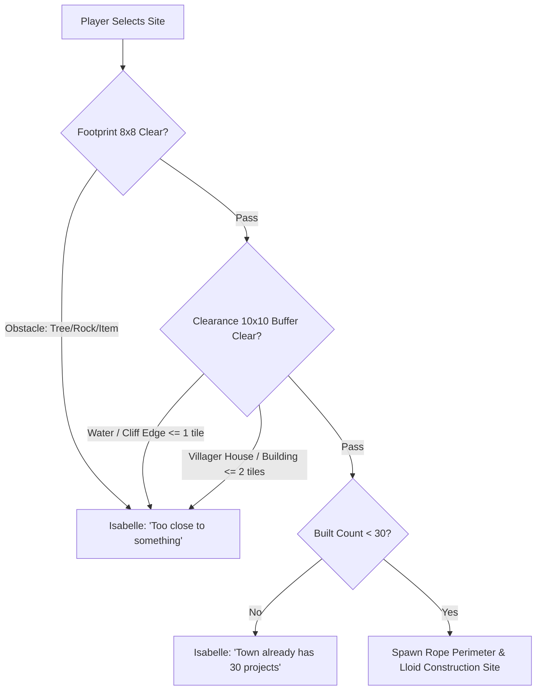

# Public Works Projects (PWP) Subsystem Specification

## 1. Overview & Architecture

The Public Works Projects (PWP) engine in *Animal Crossing: New Leaf — Welcome amiibo* allows the town Mayor to construct bridges, decorative structures, town amenities (Police Station, Reset Center, Cafe), and outdoor furniture.

The system encompasses:
1. **PWP Catalog & Unlock Registry:** Tracking which projects have been unlocked via villager requests (`PWP_UnlockProject` / `0x0024DD34`).
2. **Spatial Clearance & Placement Grids:** Rigorous collision testing of the project's foundation footprint ($8 \times 8$) and perimeter clearance buffer ($10 \times 10$) against terrain features, water, cliffs, and buildings (`FUN_002D4F24`).
3. **Fundraising & Lloid Gyroid:** Managing active construction sites, player Bell donations, and completion detection (`AcRobjHaniwa`, `PWP_CheckDonationComplete` / `0x0024E0D8`).
4. **Completion Ceremonies:** Triggering town celebrations attended by the Mayor and animal villagers (`AcNpcSpSecretaryCeremony` / `0x00576484`, `BBS_Pworks.umsbt`).

---

## 2. Save Data Layout (`garden_plus.dat`)

The PWP subsystem resides at save file offset **`0x5D880` .. `0x621CB`** (18,508 bytes), structured into 4 instances of `PWPSaveBlock` (4,648 bytes / `0x1228` each):

| Offset | Field | Type | Description |
|---|---|---|---|
| `+0x0000` | Header | `uint8_t[0x18]` | Internal management header |
| `+0x0018` | `projects[6]` | `PWPEntryRecord[6]` | 6 Active construction / pending project slots (`0x302` bytes each) |
| `+0x1224` | `built_projects_count` | `uint16_t` | Current total number of completed PWPs in town |
| `+0x1226` | `max_allowed_projects` | `uint8_t` | Hardcoded ceiling: **`0x1E` (30 projects max)** |
| `+0x1227` | Pad | `uint8_t` | Alignment byte |

### Single Project Record (`PWPEntryRecord` / `0x302` bytes = 770 bytes)
- `+0x01E`: Active state flag (`1` = placed/under construction).
- `+0x01F`: Completion state (`0` = fundraising in progress, `1` = built).
- `+0x062 .. +0x1F1`: **$10 \times 10$ Tile Collision Buffer** (400 bytes): evaluates surrounding clearance from cliffs, rivers, and neighboring buildings.
- `+0x1F2 .. +0x2F1`: **$8 \times 8$ Tile Placement Grid** (256 bytes): evaluates direct footprint tiles for obstactles (trees, rocks, flowers).
- `+0x2F2`: Primary Structure Item ID (e.g. `0x23A0`).
- `+0x2F6`: Secondary / Ancillary Item ID (e.g. `0x243D`).

---

## 3. Placement Clearance & Grid Testing (`FUN_002D4F24`, `PWP_ValidateAndPlaceProject`)

When Isabelle walks with the player to select a site:

### Buffer Rules:
1. **River & Cliff Buffer:** Requires at least **1 full tile** of open grass between the project boundary and river banks or cliff walls.
2. **Building & House Buffer:** Requires at least **2 full tiles** of open grass between the project boundary and villager houses, Town Hall, Re-Tail, or Town Gates.
3. **Bridge Restrictions:** Bridges must connect two straight, parallel riverbanks exactly 4 tiles apart, with 1 tile of open land on both sides for entry/exit ramps.

---

## 4. Project Unlocking Engine (`PWP_UnlockProject` / `0x0024DD34`)

Town villagers unlock new projects dynamically during daily pings (`!` exclamation mark):
- Personality dictates the project unlocked (e.g., Peppy unlocks Modern Bridge/Fairy-Tale Bench; Cranky unlocks Zen Bell/Statue).
- `PWP_UnlockProject` inspects the 40-byte unlocked project buffer at `param_1`:
  1. Checks if project ID already exists in the list ($s = 0..39$). If found, returns without changes.
  2. Finds the first unoccupied byte (`0x00`) and inserts the newly suggested project ID.

---

## 5. Fundraising & Completion Flow

1. Once placed, Lloid (`AcRobjHaniwa`) spawns at the construction perimeter.
2. Players donate Bells directly to Lloid until `donations >= target_cost`.
3. At 06:00 AM the next day (game day rollover):
   - Project transitions from active construction (`PWPEntryRecord`) to built infrastructure.
   - `built_projects_count` increments.
   - Isabelle posts completion announcement to Town Bulletin Board (`BBS_Pworks.umsbt`).
   - Mayor is invited to hold a celebration ceremony (`AcNpcSpSecretaryCeremony` / `0x00576484`).
