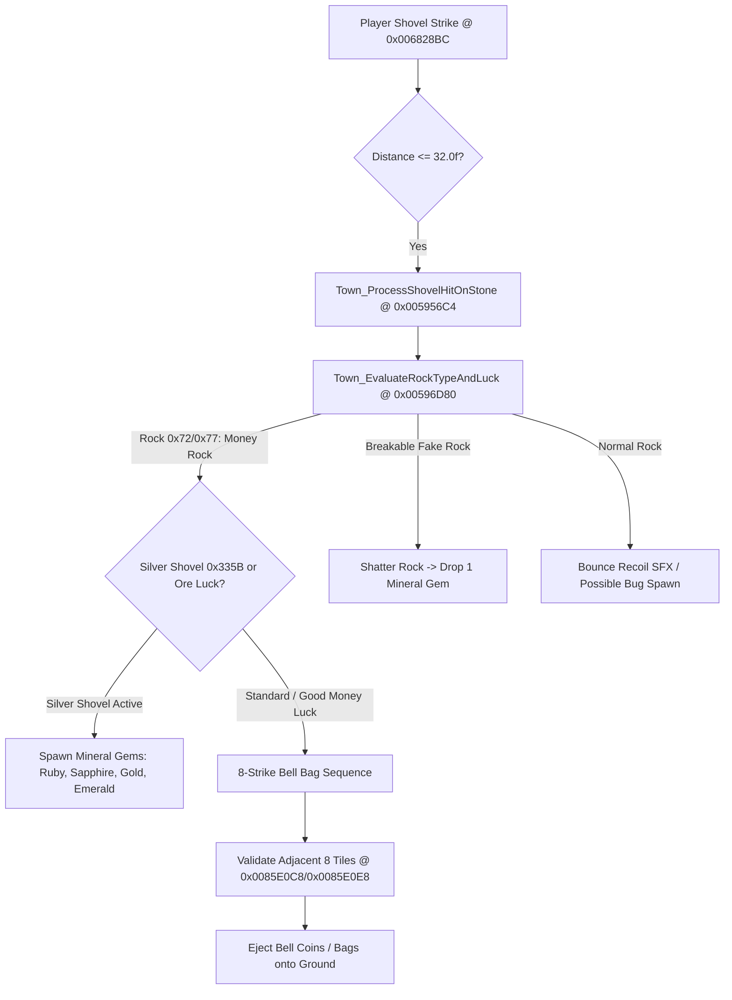

# Town Rock, Money Rock & Silver Shovel Mineral Mechanics

> **Target Title:** Animal Crossing: New Leaf — Welcome amiibo (CTR, Title ID `0004000000198F00`)  
> **Source Files (Reverse-Engineered):** `exefs.elf` (`0x005956C4`, `0x00596D80`, `0x0059EA7C`, `0x006828BC`, `0x00766A5C`), `STR_Item_name.umsbt`  
> **Status:** `done` (Byte-exact decompilation, verified 8-strike loop, drop offset tables, and item IDs)

---

## 1. Overview & Architecture

Rocks in Animal Crossing: New Leaf are persistent environmental fixtures (and daily dynamic spawns) that yield currency, minerals, and insects upon shovel strikes:
1. **Stone Model Classifications:** 5 physical rock shapes mapped to base and active IDs `0x71`..`0x7A` (`Town_EvaluateRockTypeAndLuck` `0x00596D80`).
2. **Money Rock of the Day (`0x72` / `0x77`):** One existing town stone is randomly designated as the daily Money Rock at the 6:00 AM day boundary.
3. **8-Strike Payout Sequence:** Striking the Money Rock rapidly within the recoil combo window yields up to **8 consecutive item drops** (`Town_SpawnRockHitReward` `0x0059EA7C`).
4. **Surrounding Drop Geometry:** Drops are propelled outward into the 8 adjacent grid tiles (`DAT_0085e0c8` and `DAT_0085e0e8`). Obstruction checks (`FUN_00613100`) skip holes, weeds, or obstacles.
5. **Silver Shovel Mineral Drops:** Equipping a Silver Shovel (`0x335B`) enables a chance to replace currency with precious mineral gems (`Item_ApplySilverShovelRockModifier` `0x00766A5C`).
6. **Breakable Daily Fake Rock:** One additional fragile rock spawns daily in town, shattering on the first strike into a guaranteed mineral piece.

---

## 2. Rock Classifications & Visual IDs

`[TOOL]` Evaluated in `Town_EvaluateRockTypeAndLuck` (`0x00596D80`):

| Base ID | Hit / Active ID | Classification | Behavior & Drops |
|---|---|---|---|
| `0x71` | `0x76` | **Normal Rock A** | Standard stationary rock; yields insects (Pill bug, Centipede). |
| `0x72` | `0x77` | **Money Rock** | Active coin rock of the day. Produces 8 drops of Bells or multi-gems. |
| `0x73` | `0x78` | **Normal Rock B** | Standard stationary rock. |
| `0x74` | `0x79` | **Normal Rock C** | Standard stationary rock. |
| `0x75` | `0x7A` | **Normal Rock D** | Standard stationary rock. |

---

## 3. 8-Strike Progressive Payout Loop

`[TOOL]` Function: `Town_SpawnRockHitReward` (`0x0059EA7C`):
- Loop condition: `do { ... iVar6++; } while (iVar6 < 8);`
- **Standard Payout Sequence (Total: 16,100 Bells):**
  1. Strike 1: **100 Bells** (Coin `0x209E`)
  2. Strike 2: **200 Bells** (Bag `0x20AC`)
  3. Strike 3: **300 Bells** (Bag `0x20AC`)
  4. Strike 4: **500 Bells** (Bag `0x20AC`)
  5. Strike 5: **1,000 Bells** (Bag `0x20AC`)
  6. Strike 6: **2,000 Bells** (Bag `0x20AC`)
  7. Strike 7: **4,000 Bells** (Bag `0x20AC`)
  8. Strike 8: **8,000 Bells** (Bag `0x20AC`)
- **Upgraded Sequence under Good Money Luck (`DAT_00952f68 == 0`):**
  Uses upgraded bags `0x20AD` and `0x2119` (100 $\to$ 200 $\to$ 500 $\to$ 1,000 $\to$ 2,000 $\to$ 4,000 $\to$ 8,000 $\to$ 16,000 Bells, total **32,000 Bells**).
- **Bad Money Luck (`DAT_00952f68 == 1`):**
  `Town_EvaluateRockTypeAndLuck` returns `0`, immediately cancelling the Money Rock activation (produces 0 Bells).

---

## 4. Surrounding Tile Coordinate Geometry

`[TOOL]` Adjacent drop destination offsets from tables `DAT_0085e0c8` ($\Delta X$) and `DAT_0085e0e8` ($\Delta Y$):

| Index | $\Delta X$ (`0x0085E0C8`) | $\Delta Y$ (`0x0085E0E8`) | Compass Direction |
|---|---|---|---|
| `0` | `+1` | `+1` | North-East |
| `1` | ` 0` | `+1` | North |
| `2` | `+1` | ` 0` | East |
| `3` | `+1` | `-1` | South-East |
| `4` | `-1` | `+1` | North-West |
| `5` | `-1` | `-1` | South-West |
| `6` | ` 0` | `-1` | South |
| `7` | `-1` | ` 0` | West |

Each candidate position is checked with `FUN_00613100(targetX, targetY)`. If occupied by a dug hole, custom pattern, tree, flower, or ocean cliff, the algorithm skips to the next offset, preventing item despawns.

---

## 5. Silver Shovel & Mineral Ore Drops

`[TOOL]` Functions: `Item_ApplySilverShovelRockModifier` (`0x00766A5C`) & `Town_SpawnRockHitReward` (`0x0059EA7C`):
- Tool ID: `0x335B` (**Silver shovel**).
- When a player strikes a stone while holding `0x335B`, bit `0` of the rock attribute word is set: `param_2[1] |= 1`.
- Under this flag, or when **Good Ore Luck** is active (`DAT_00952f68 == 0x06`), the loot spawner queries `FUN_006f1938` to generate mineral gems instead of Bells:

| Item ID | Mineral Gem (`[RECALL]`) | Sell Price (`[RECALL]`) |
|---|---|---|
| `0x20A2` | **Gold nugget** (Золотой самородок) | 4,000 Bells |
| `0x20A3` | **Silver nugget** (Серебряный самородок) | 3,000 Bells |
| `0x20A4` | **Ruby** (Рубин) | 2,000 Bells |
| `0x20A5` | **Sapphire** (Сапфир) | 2,000 Bells |
| `0x20A6` | **Emerald** (Изумруд) | 2,000 Bells |
| `0x20A7` | **Amethyst** (Аметист) | 2,000 Bells |

---

## 6. Function Catalog

| Address | Function Symbol | Subsystem | Description |
|---|---|---|---|
| `0x006828BC` | `Player_HitStoneWithShovel` | Player | Dispatches shovel strike on stone: distance $\le 32.0$f check and bounce recoil |
| `0x005956C4` | `Town_ProcessShovelHitOnStone` | Town | Evaluates rock tile hit and enqueues event into 4-slot drop queue |
| `0x0059EA7C` | `Town_SpawnRockHitReward` | Town | 8-strike reward loop, adjacent tile routing, Bell/ore drop generation |
| `0x00596D80` | `Town_EvaluateRockTypeAndLuck` | Town | Classifies rock model types `0x71`..`0x7A` and checks Bad Money Luck |
| `0x00766A5C` | `Item_ApplySilverShovelRockModifier` | Item | Detects Silver Shovel `0x335B` and sets multi-gem drop flag `param_2[1] |= 1` |

---

## 7. C++ Port Reference

Include header in the PC port:
- [`types/Rock.h`](file:///c:/Users/user/Documents/acnl_re/types/Rock.h): Contains `RockType`, `OreItem`, `BellDropItem`, `ShovelTool`, `kRockDropOffsets`, and payout arrays.
