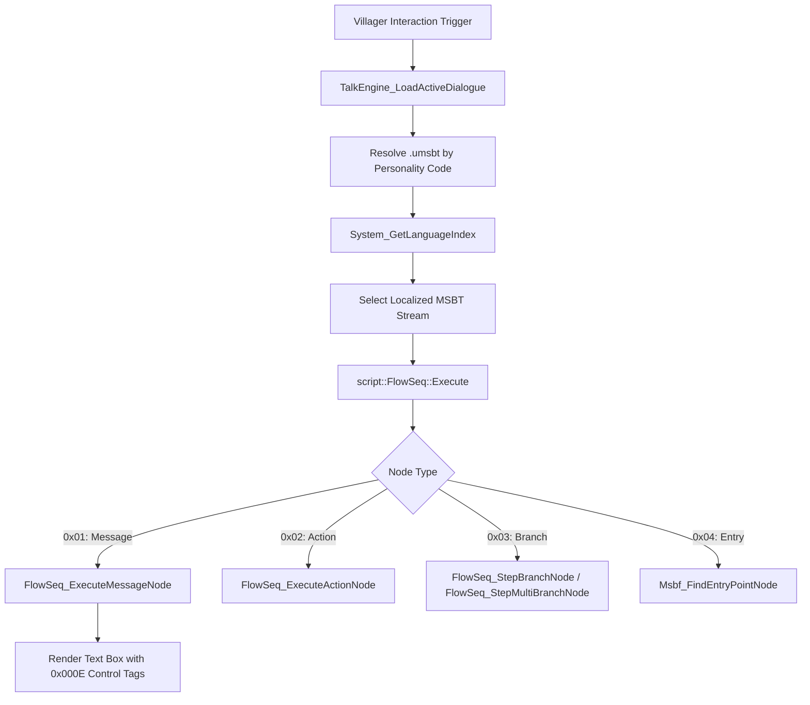

# Dialogue, Event Flow & Script Engine (Message Studio)

> **Subsystem:** Dialogue & Scripting  
> **Status:** Fully Reverse-Engineered  
> **Binary Source:** `exefs.elf` (`0x00159718` - `0x00159f70`, `0x005b07b8` - `0x005b0898`, `0x005f2614` - `0x005f3b14`, `0x00600ee4` - `0x0060196c`)  
> **C++ Types Header:** [`types/Script.h`](../types/Script.h)  
> **Target Data Files:** RomFS `Script/` (`.umsbt`, `.msbf`, `CTR_GardenPlus.msbp`)

---

## 1. Architecture Overview

Animal Crossing: New Leaf utilizes Nintendo's **Message Studio Binary** system to drive all in-game text, villager conversations, cutscenes, and decision logic:

1. **MSBT (`MsgStdBn`):** Localized text strings with embedded control codes (colors, emotion animations, player/town name interpolation, pauses).
2. **MSBF (`MsgFlwBn`):** Event flowcharts (node-based dialogue graphs containing messages, action triggers, boolean branches, and choice menus).
3. **MSBP (`MsgPrjBn`):** Project configuration (`Script/CTR_GardenPlus.msbp`) containing the text color palette (`CLR1`), color names (`CLB1`), and flow metadata (`CTI1`).
4. **UMSBT Container:** Multi-language package containing localized MSBT files for 10 supported regional languages.



---

## 2. Binary File Layouts

### 2.1 Common Header (`MsbHeader`, 32 bytes)
All Message Studio files begin with a standard 32-byte header:

| Offset | Type | Field | Description |
|---|---|---|---|
| `0x00` | `char[8]` | `magic` | `"MsgStdBn"` (MSBT), `"MsgFlwBn"` (MSBF), or `"MsgPrjBn"` (MSBP) |
| `0x08` | `uint16_t` | `byte_order_mark` | `0xFEFF` (CTR Little-Endian) |
| `0x0A` | `uint16_t` | `version` | Format revision (0x0000 / 0x0001) |
| `0x0C` | `uint16_t` | `section_count` | Number of 16-byte aligned sections |
| `0x0E` | `uint16_t` | `reserved` | Padding |
| `0x10` | `uint32_t` | `file_size` | Total binary size in bytes |
| `0x14` | `uint8_t[10]`| `padding` | Reserved zeroes |

### 2.2 Section Header (`MsbSectionHeader`, 16 bytes)
Each section begins on a 16-byte aligned boundary:

```c
struct MsbSectionHeader {
    char     tag[4];      // FourCC tag ("LBL1", "TXT2", "ATR1", "FLW3", "FEN1", etc.)
    uint32_t size;        // Size of section payload (excluding this 16-byte header)
    uint8_t  reserved[8]; // Padding
};
```

---

## 3. MSBT (Message Studio Binary Text)

An MSBT file contains three primary sections:
- **`LBL1` (Label Table):** Hash table of label strings mapping text keys (e.g. `Talk_001`) to string indices.
- **`ATR1` (Attribute Table):** Per-string metadata (font ID, sound style).
- **`TXT2` (Text Table):** Count of strings followed by an array of 32-bit relative offsets to UTF-16LE null-terminated strings.

### 3.1 Hash Lookup Algorithm (`Msbt_CalculateLabelHash`, `0x00159de4`)
Labels are hashed using a multiplicative shift accumulator:

$$\text{hash} = \sum_{i=0}^{n-1} c_i \cdot 1170^{n-1-i} \pmod{\text{bucket\_count}}$$

```cpp
uint32_t CalculateLabelHash(std::string_view label, uint32_t bucket_count) {
    if (bucket_count == 0) return 0;
    uint32_t hash = 0;
    for (char c : label) {
        hash = hash * 0x492 + static_cast<uint8_t>(c); // 0x492 = 1170
    }
    return hash % bucket_count;
}
```

### 3.2 Control Tag Encoding (`0x000E` Escape)
Within dialogue strings, dynamic markup is encoded using the UTF-16 character `0x000E`:

```
[0x000E] [uint16_t GroupID] [uint16_t TagID] [uint16_t ParamLength] [Payload Bytes...]
```

#### Supported Tag Groups:
- **Group `0x0007` (Color):** Selects dialogue text color from `kDialoguePalette` (0..7).
- **Group `0x000C` (Variable):**
  - Tag `0`: Player Name
  - Tag `1`: Town Name
  - Tag `2`: Villager Name
  - Tag `5`: Catchphrase
  - Tag `6`: Target Item Name
  - Tag `8`: Number / Bells
- **Group `0x0003` (Emotion/Animation):** Triggers NPC animations during speech (e.g. `Tag 0` = Smile, `Tag 21` = Shock, `Tag 37` = Ponder/Thinking).
- **Group `0x0009` (Choice Menu):** Prompts the player with interactive dialogue response options.

---

## 4. MSBF (Message Studio Binary Flow)

MSBF files encode directed acyclic flowcharts guiding conversation trees:
- **`FLW3`:** Array of 16-byte `FlwNode` records.
- **`FEN1`:** Flow Entry points table (hash table mapping entry strings to root node indices).
- **`REF1`:** Cross-file references to subflows.

### 4.1 Flow Node Types

| Node Type | Byte Code | Operation | Target Dispatched |
|---|---|---|---|
| **Message** | `0x01` | Displays dialogue box | Calls `FlowSeq_ExecuteMessageNode` (`0x005f2614`) |
| **Action** | `0x02` | Executes gameplay event | Calls `FlowSeq_ExecuteActionNode` (`0x005f305c`) |
| **Branch** | `0x03` | Evaluates boolean condition | Calls `FlowSeq_StepBranchNode` (`0x005f2a4c`) |
| **MultiBranch**| `0x03` (sub) | Dialogue choice menu | Calls `FlowSeq_StepMultiBranchNode` (`0x005f2afc`) |
| **EntryPoint** | `0x04` | Flow root | Calls `Msbf_FindEntryPointNode` (`0x00159634`) |

---

## 5. Standard Color Palette (`CTR_GardenPlus.msbp`)

The 8 standard dialogue colors decoded from `CLR1` / `CLB1` in `CTR_GardenPlus.msbp`:

| Index | Name | Hex Code | Purpose |
|---|---|---|---|
| **0** | `Default` | `#07000000` | Standard body text (Black) |
| **1** | `Player` | `#FFFFFFFF` | White highlight / Player identity |
| **2** | `Important` | `#F55AE6FF` | Key terms, dates, quest targets (Pink/Magenta) |
| **3** | `Town` | `#00BEDCFF` | Town name, river, ocean mentions (Cyan) |
| **4** | `NPC` | `#00C300FF` | Villager & Special NPC names (Green) |
| **5** | `Tweet` | `#F08C00FF` | Shouting / exclamation text (Orange) |
| **6** | `ForEscapeIsland` | `#A5BEDCFF` | Mini-game Desert Island Escape (Pastel blue) |
| **7** | `Alert` | `#FF2020FF` | Warnings / Bee stings / Danger (Bright red) |

---

## 6. Villager Personality Script Matrix

Villager dialogue files in `Script/Talk/` are partitioned by 8 core personalities:

| Code | Personality | Japanese | Trait Focus | Sample File |
|---|---|---|---|---|
| `An` | Uchi / Big Sister | Aneki | Blunt, caring, late sleeper | `AN_3P_An.umsbt` |
| `Bo` | Lazy | Boku | Food, insects, sleeping | `AN_3P_Bo.umsbt` |
| `Fu` | Normal | Futsuu | Books, cooking, polite | `AN_3P_Fu.umsbt` |
| `Ge` | Smug | Gekijo | Polite, gentlemanly, music | `AN_3P_Ge.umsbt` |
| `Ha` | Jock | Harikiri | Fitness, muscles, sports | `AN_3P_Ha.umsbt` |
| `Ko` | Cranky | Kowai | Deep voice, nostalgic, grumpy | `AN_3P_Ko.umsbt` |
| `Ot` | Snooty | Otona | Fashion, makeup, gossip | `AN_3P_Ot.umsbt` |
| `Zk` | Peppy | Genki | Becoming a pop-star, energetic | `AN_3P_Zk.umsbt` |

---

## 7. Function Catalog

| Address | Function Symbol | Description |
|---|---|---|
| `0x005d3734` | `System_GetLanguageIndex` | Resolves game language index (0..9) from region settings |
| `0x00159a30` | `Msg_MsbtFile_Init` | Initializes MSBT parser and maps LBL1, TXT2, ATR1 sections |
| `0x001599a8` | `Msg_MsbfFile_Init` | Initializes MSBF parser and maps FLW3, FEN1, REF1 sections |
| `0x00159af0` | `Msg_MsbpFile_Init` | Initializes MSBP parser and maps CLR1, CLB1, CTI1 sections |
| `0x00159c74` | `Msg_Header_ParseSections` | Validates BOM and parses 16-byte aligned section descriptors |
| `0x00159f08` | `Msg_FindSectionByTag` | Searches section array by 4-byte FourCC tag |
| `0x00159718` | `Msg_GetSectionDataPtr` | Bounds-checked data offset access in section |
| `0x00159de4` | `Msbt_CalculateLabelHash` | Computes 1170-multiplier hash for label string |
| `0x001598ac` | `Msbt_FindStringIndexByLabel`| Finds string index in LBL1 table by label name |
| `0x00159804` | `Msbt_GetStringByIndex` | Retrieves UTF-16 string pointer from TXT2 by index |
| `0x00159848` | `Msbt_GetStringByLabel` | Looks up label and returns string pointer |
| `0x00159750` | `Msbt_GetLabelNameByIndex` | Reverse lookup of label string from index |
| `0x005b07b8` | `Msg_MsbtWrapper_Load` | Wraps MSBT buffer allocation and initialization |
| `0x005b0854` | `Msg_MsbfWrapper_Load` | Wraps MSBF buffer allocation and initialization |
| `0x005b0870` | `Msg_MsbfWrapper_Destroy` | Releases MSBF flowchart resources |
| `0x00523378` | `Msg_LoadSwkbdMsbt` | Loads keyboard message text (`swkbd.msbt`) and style (`RI.mstl`) |
| `0x00159634` | `Msbf_FindEntryPointNode` | Looks up entry point in FEN1 and returns initial node ID |
| `0x005f305c` | `FlowSeq_ExecuteActionNode`| Dispatches Type 2 action events and steps forward |
| `0x005f2a4c` | `FlowSeq_StepBranchNode` | Evaluates boolean condition and chooses branch |
| `0x005f2afc` | `FlowSeq_StepMultiBranchNode`| Evaluates choice menu selection in multi-branch table |
| `0x005f29a4` | `FlowSeq_StepToNextNode` | Advances sequential node or sets flow termination |
| `0x005f2614` | `FlowSeq_ExecuteMessageNode`| Formats talk parameters and displays message dialogue box |
| `0x00600ee4` | `TalkEngine_ResetDialogueBuffer`| Cleans up active talk text buffer |
| `0x00601664` | `TalkEngine_LoadActiveDialogue`| Resolves UMSBT localized block and binds dialogue |
