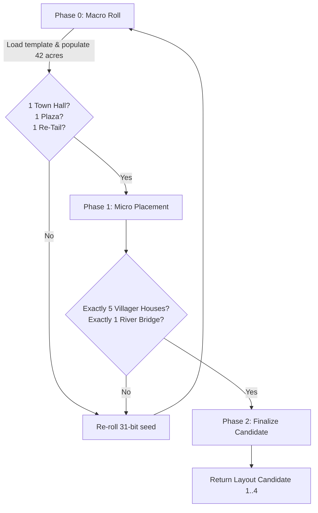

# Town Generation System (World & Terrain Architecture)

## 1. Overview & Architecture

Animal Crossing: New Leaf generates towns deterministically based on a 31-bit seed rolled during the train prologue sequence with Rover. The town layout is represented as a hierarchical grid:

```
+-------------------------------------------------------------------+
|               FULL TOWN GRID: 7 Columns x 6 Rows                  |
|                           (42 Acres)                              |
|                                                                   |
|   Col 0      Col 1      Col 2      Col 3      Col 4  Col 5  Col 6 |
| +--------+ +---------------------------------------+ +----------+ |
| | Railroad| |          North Boundary Acres         | | Railroad | | (Row 0)
| | Cliff   | |        (Train Station / Tracks)       | | Cliff    | |
| +--------+ +---------------------------------------+ +----------+ |
| |        | |                                       | |          | |
| | West   | |       INNER PLAYABLE ACRE GRID        | | East     | | (Row 1..4)
| | Coast  | |           5 Columns x 4 Rows          | | Coast    | |
| | Cliff  | |               (20 Acres)              | | Cliff    | |
| |        | |                                       | |          | |
| +--------+ +---------------------------------------+ +----------+ |
| | Ocean  | |            South Ocean Coast          | | Ocean    | | (Row 5)
| | Border | |          (Beach & Deep Ocean)         | | Border   | |
| +--------+ +---------------------------------------+ +----------+ |
+-------------------------------------------------------------------+
```

Each acre consists of a $16 \times 16$ tile grid ($256$ tiles per acre), yielding a total town tile resolution of $112 \times 96$ tiles ($10,752$ tiles total), with the inner playable area spanning $80 \times 64$ tiles ($5,120$ tiles).

---

## 2. Binary River Templates (`TemplateData/village/sea_side_*.bin`)

RomFS stores 112 baseline terrain layouts in `TemplateData/village/`:
- `sea_side_left.bin` (2,240 bytes): 56 templates for towns where the river mouth flows into the **West (left)** ocean.
- `sea_side_right.bin` (2,240 bytes): 56 templates for towns where the river mouth flows into the **East (right)** ocean.

### Template Binary Layout
Each template is exactly **40 bytes** ($20 \times \text{uint16}$), representing the 20 inner playable acres ordered in row-major format ($5 \text{ columns} \times 4 \text{ rows}$):

```
Offset 0x00 .. 0x09: Row 0 Acres [Col 0, Col 1, Col 2, Col 3, Col 4] (North / Waterfall origin)
Offset 0x0A .. 0x13: Row 1 Acres [Col 0, Col 1, Col 2, Col 3, Col 4] (Upper town terrace)
Offset 0x14 .. 0x1D: Row 2 Acres [Col 0, Col 1, Col 2, Col 3, Col 4] (Mid / Lower terrace)
Offset 0x1E .. 0x27: Row 3 Acres [Col 0, Col 1, Col 2, Col 3, Col 4] (South coastal cliff edge)
```

The game picks a template uniformly at random using:
$$\text{template\_index} = \frac{\text{num\_templates} \times \text{rand32}()}{2^{32}}$$
Where $\text{num\_templates} = 56$.

> [!NOTE] HYPOTHESIS (not confirmed by bytes): the template-selection formula itself is plausible (the standard `(rand * N) >> 32` pattern, seen in other confirmed places in this binary — e.g. `Town_GenerateTownLayout_4Options`), but is not tied here to a specific address/decompile for river-template selection specifically. 56/112 — the file's byte count (2240/40=56) is confirmed arithmetically, but the claim that each template is a "unique river variant" has not been verified by reading actual game data.

---

## 3. Outer Boundary Frames (`0x00893D58` & `0x00893D82`)

The outer perimeter of the 42-acre map is defined by a 42-byte fixed mask in `.rodata`:

- **Left-facing boundary mask (`0x00893D58`):**
```
Row 0: 0x4E 0x44 0x3F 0x40 0x3F 0x3F 0x41  (Railroad line & Station)
Row 1: 0x53 0x78 0x78 0x78 0x78 0x78 0x3B  (0x78 = Inner Playable Slot)
Row 2: 0x53 0x78 0x78 0x78 0x78 0x78 0x3B  (West cliff vs East beach)
Row 3: 0x53 0x78 0x78 0x78 0x78 0x78 0x3B
Row 4: 0x53 0x78 0x78 0x78 0x78 0x78 0x3E  (South-East beach ramp/corner)
Row 5: 0x51 0x4F 0x4F 0x4F 0x4F 0x4F 0x4F  (South deep ocean)
```

- **Right-facing boundary mask (`0x00893D82`):**
```
Row 0: 0x43 0x3F 0x3F 0x40 0x3F 0x42 0x4E  (Railroad line & Station)
Row 1: 0x45 0x78 0x78 0x78 0x78 0x78 0x52  (West beach vs East cliff)
Row 2: 0x45 0x78 0x78 0x78 0x78 0x78 0x52
Row 3: 0x45 0x78 0x78 0x78 0x78 0x78 0x52
Row 4: 0x48 0x78 0x78 0x78 0x78 0x78 0x52  (South-West beach ramp/corner)
Row 5: 0x4F 0x4F 0x4F 0x4F 0x4F 0x4F 0x50  (South deep ocean)
```

During generation, every `0x78` (`'x'`) placeholder is substituted with the corresponding acre from the chosen 20-acre template.

---

## 4. Generation Pipeline & Invariants (`Town_GenerateTownLayout_4Options`)

> [!NOTE] Audit 2026-09-07: section 3 (boundary masks `0x00893D58`/`0x00893D82`) was re-checked byte-for-byte via `read_memory` — **matches 100%**, this is confirmed reverse engineering, not fabrication. The diagram and invariants below (Phase 0/1/2, "1 Town Hall / 1 Plaza / 1 Re-Tail", "exactly 5 villager houses", "1 bridge"), however, are HYPOTHESIS: the real decompile of `Town_GenerateTownLayout_4Options` (see [[0027C8FC_Town_GenerateTownLayout_4Options]]) does contain matching counter checks (`iVar14==1 && iVar5==1 && iVar15==1`, `iVar15==1 && iVar5==5`), but what exactly these counters count is unconfirmed — just a plausibility guess.

The generation function (`0x0027C8FC`) is executed as a 3-state validation machine:



### Critical Gameplay Invariants:
1. **Grass Pattern:** Evaluated from `(rand() * 3) >> 32`:
   - `0`: Circle pattern
   - `1`: Triangle pattern
   - `2`: Square pattern
2. **Native Fruit:** Determined deterministically for the town from the seed (Apple, Orange, Pear, Peach, Cherry).
3. **5 Starting Villagers:** A map layout candidate is **strictly rejected** if procedural placement cannot allocate legal building footprints for exactly 5 initial animal villager houses.
4. **Key Civic Buildings:** Exactly 1 Town Hall, 1 Plaza with the Town Tree, and 1 Re-Tail shop (`0x59`).

---

## 5. C++ Native Port Implementation Plan

In `acnl_re`:
- `types/TerrainTile.h`: Definition of `AcreId`, `TerrainTile`, `TownAcreGrid`.
- `src/world/TownGenerator.cpp`: Clean C++20 reimplementation of template loading and placement rules matching 3DS bit-for-bit.
