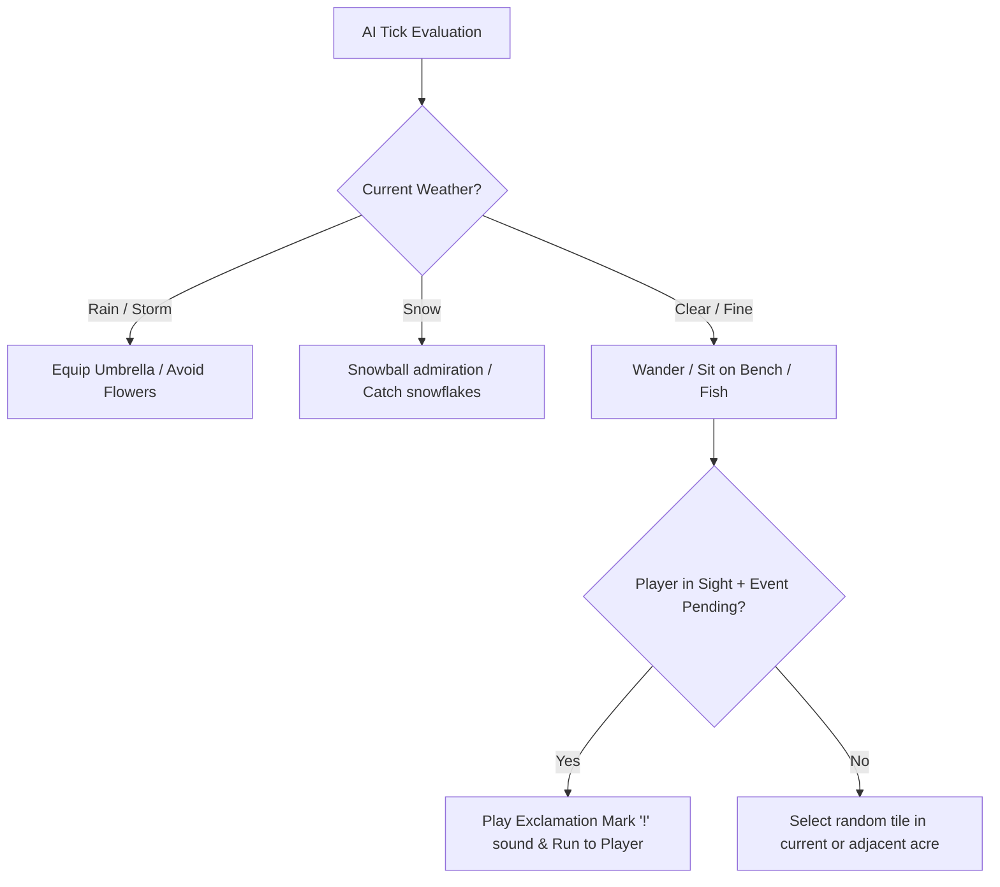

# Villager AI & Behavior Subsystem (`AcNpcNml`)

> [!WARNING] ⚠️ Integrity audit 2026-09-07
> Sections 1–4 (actor hierarchy, personalities, AI diagram, quest list Q01-Q12) are general game knowledge (wiki/gameplay), not tied to specific addresses/decompile in this file. Useful as a reference for future code lookup, but not a result of reverse engineering.
> Section 5 (bit layout of `+0x270`, specific friendship points +1/+2-3/+3-5/-3/-5) is HYPOTHESIS — the numbers are not confirmed by reading code in this document.
> Section 6 contained a factual error: "Initializes relationship state byte +0x270 to 1 (Unpacking boxes)" — incorrect. The real decompile of `Villager_MoveIn_AssignPlayerSlot` (see [[006F3F78_Villager_MoveIn_AssignPlayerSlot]], re-checked 2026-09-07) shows that byte `+0x270` is **copied** from `+0x1b70` of the queue, not set to the constant `1`. The "Unpacking boxes" = state 1 value itself is unconfirmed.

## 1. Overview & Actor Hierarchy

Animal Crossing: New Leaf manages up to 10 simultaneous animal villagers in the player's town. All animal villagers derive from the common actor root `AcObjectBase`:

```
AcObjectBase
   └── DemoActor
         └── AcNpc
               ├── AcNpcSp   (Special NPCs: Isabelle, Tom Nook, Rover, Resetti)
               └── AcNpcNml  (Normal Animal Villagers: 333+ species)
```

Each normal villager possesses:
1. **Personality Type** (8 discrete categories)
2. **AI State Machine** (`NNPC_Ai.msbf` / `VillagerAiState`)
3. **Dialogue & Quest Dispatcher** (`NNPC_Q01` .. `NNPC_Q12`)
4. **Spatial Navigation & Pathfinding** (`RoadSearchSetupCandCB`, `FdBkSearchCand`)

---

## 2. Personalities & Internal Codes

Nintendo identifies the 8 personalities using two-letter Japanese phonetic abbreviations:

| Code | Personality | Japanese Name | Sleep Schedule | Dialogue Archetype |
|---|---|---|---|---|
| `BO` | Lazy | ぼんやり (*Bonyari*) | 11:00 PM – 7:30 AM | Food, bugs, naps, relaxed nature |
| `HA` | Jock | ハキハキ (*Hakihaki*) | 12:30 AM – 6:30 AM | Bodybuilding, muscles, cardio, stamina |
| `KO` | Cranky | コワイ (*Kowai*) | 3:30 AM – 9:00 AM | Grumpy, old-fashioned, nostalgic |
| `ZK` | Smug | キザ (*Kiza*) | 1:30 AM – 7:00 AM | Suave, dance, romance, gentlemen |
| `FU` | Normal | ふつう (*Futsuu*) | 12:00 AM – 6:00 AM | Reading, baking, polite, humble |
| `GE` | Peppy | げんき (*Genki*) | 1:30 AM – 7:00 AM | Pop idol, cheering, energetic, fashion |
| `OT` | Snooty | オトナ (*Otona*) | 2:00 AM – 8:30 AM | High fashion, makeup, classy, gossip |
| `AN` | Sisterly | アネキ (*Aneki*) | 3:00 AM – 9:30 AM | Protective, big sister, night owl, remedies |

*Note: The town ordinances "Early Bird" and "Night Owl" shift wake-up and sleep times by $\pm 3$ hours respectively.*

---

## 3. Behavior Pipeline & Environmental Adaptation (`NNPC_Ai.msbf`)

The AI evaluates environmental inputs each simulation tick:



---

## 4. Quests & Interaction Matrix (`NNPC_Q01..Q12`)

| Quest | Name | Trigger | Reward / Result |
|---|---|---|---|
| `Q01` | Delivery | Villager asks player to deliver an apology/gift to another neighbor | Friendship increase, clothing or furniture |
| `Q02` | Bug Hunt | Villager wants a specific insect (e.g. Butterfly, Beetle) | Bell tip or furniture item |
| `Q03` | Fishing | Villager requests a specific river or ocean fish | Furniture reward |
| `Q04` | House Visit | Villager invites themselves to the player's home at scheduled time | Friendship boost, rating of player decor |
| `Q05` | Fruit Craving | Villager requests local fruit, perfect fruit, or island fruit | High-value reward for perfect fruit |
| `Q06` | Time Capsule | Burying/unearthing a time capsule in town | Letter + commemorative item |
| `Q08` | Scheduled Hangout| Player invited to visit villager's home | Option to purchase a furniture piece |
| `Q10` | Lost Item | Book, pouch, or mitten found on town grass | High friendship reward for returning to owner |
| `Q11` | Sickness | Villager sick in bed for 3 consecutive days | Medicine gives rare wallpaper/flooring |
| `Q12` | Petition | Signature sheet for a goofy cause from another town | Rare villager picture portrait |

---

---

## 5. Friendship System & Relationship Memory (`0x007570D0`, `0x00767150`)

Friendship in *Welcome amiibo* is tracked through an independent 640-byte (`0x280`) `PlayerVillagerRelation` sub-record for each player-villager pair (up to 4 human players $\times$ 10 animal villagers):

### Relationship State Byte (`+0x270`)
The relationship status byte combines several operational bitfields:
- **Bits [2:0] (Resident Tier):**
  - `0`: Slot unassigned / empty (`Villager_CheckSlotEmpty` / `0x0075711C`)
  - `1`: Unpacking moving boxes
  - `2`: Standard town resident
  - `3`: **Best Friend** (`Villager_CheckIsBestFriend` / `0x007570D0`: unlocks framed villager picture reward)
  - `4`: Packing boxes preparing to move out
- **Bits [4:3] (Item Exchange Status):**
  - Updated by `Villager_SetGiftExchangeStatus` (`0x00767150`) when trading items or delivering gifts.
- **Bit [5] (Spoken Today Flag):**
  - Tested by `Villager_CheckSpokenToday` (`0x00757108`) to ensure daily conversation points (+1 point) are awarded only once per in-game day.

### Friendship Point Accumulation (`+0x271`)
Numerical friendship ranges from `0` to `255`:
- Daily chat: $+1$ point (first conversation).
- Completing delivery/bug/fish quest: $+2$ to $+3$ points.
- Giving preferred/perfect fruit: $+3$ to $+5$ points.
- Pushing / hitting with net until angry/depressed: $-3$ points.
- Refusing / dropping active time capsule: $-5$ points.

---

## 6. Move-In & Slot Allocation Algorithm (`0x006F3F78`)

When a villager is scheduled to move in from the campsite, amiibo RV park, or streetpass queue:
1. `Villager_MoveIn_AssignPlayerSlot` scans the 10 active villager records in `garden_plus.dat` ($0..9$) querying `Villager_CheckSlotEmpty` (`0x0075711C`).
2. If an empty slot $u < 10$ is located:
   - Copies catchphrase ($0x31$ bytes) and custom greeting ($0x31$ bytes).
   - Copies mail history buffers ($0x42$ and $0x182$ bytes).
   - Initializes relationship state byte `+0x270` to `1` (Unpacking boxes).
   - Resets incoming queue slot at `+0x1900` via `Save_ConstructPlayerSubStruct640B`.
3. If all 10 slots are occupied, the newcomer remains in the pending moving queue until an existing resident departs.

---

## 7. C++ Port Implementation

Structures matching Nintendo's AI, schedules, and relationship records are defined in [`types/Villager.h`](file:///c:/Users/user/Documents/acnl_re/types/Villager.h) for the NPC simulation thread.
